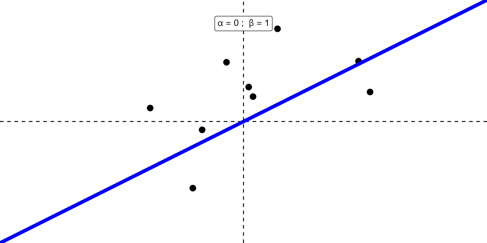
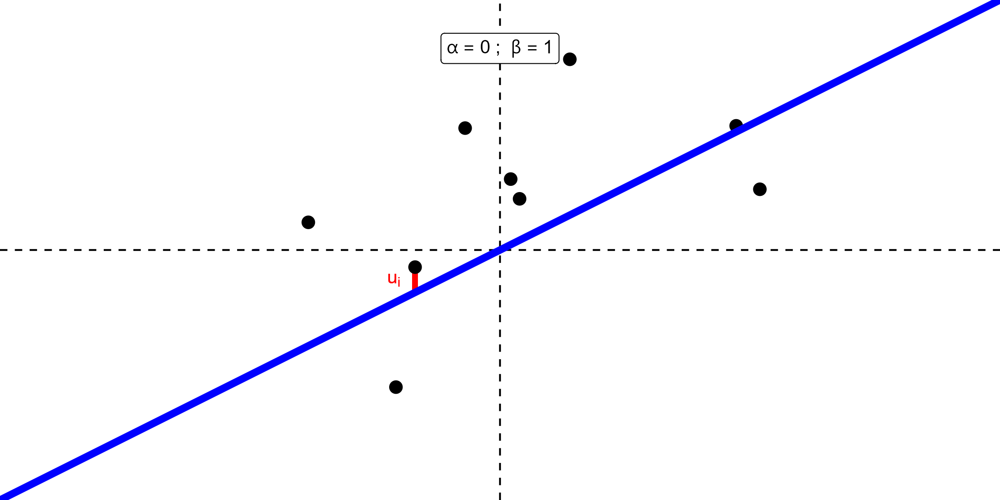
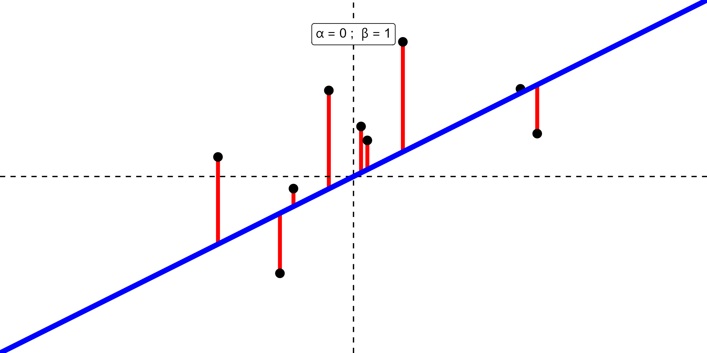
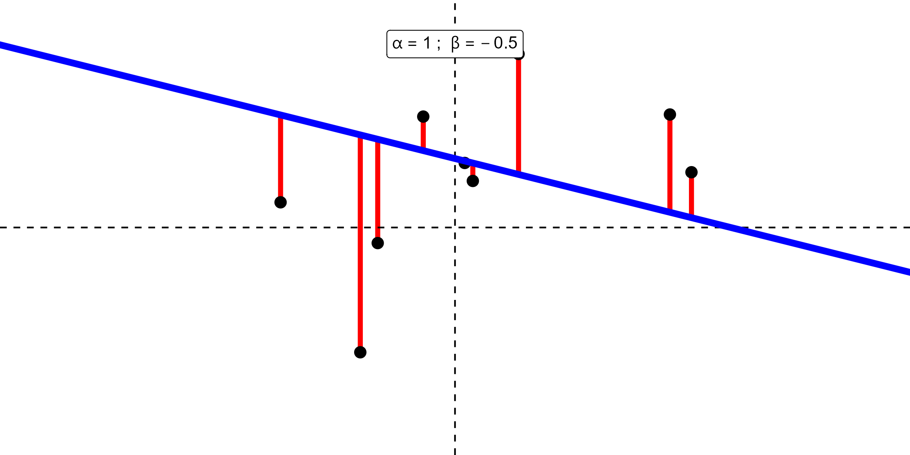
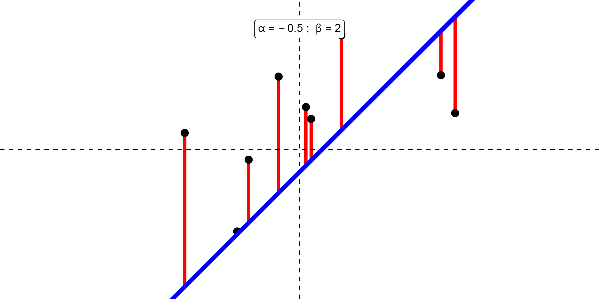
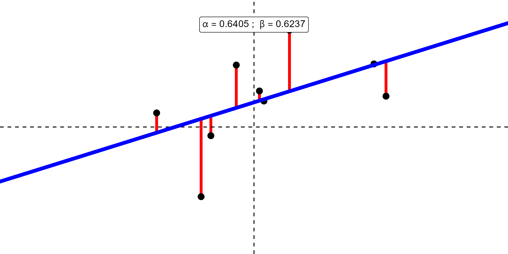

```{css,echo = F}
.small .remark-code { /*Change made here*/
  font-size: 85% !important;
}
.tiny .remark-code { /*Change made here*/
  font-size: 50% !important;
}
```

```{r,include=F}
set.seed(123)
options(width=60)
knitr::opts_chunk$set(fig.align='center',fig.width=9,fig.height=5)
def.chunk.hook  <- knitr::knit_hooks$get("chunk")
knitr::knit_hooks$set(chunk = function(x, options) {
  x <- def.chunk.hook(x, options)
  ifelse(options$size != "normalsize", paste0("\n \\", options$size,"\n\n", x, "\n\n \\normalsize"), x)
})
require(tidyverse)
require(ggpubr)
```

# Agenda

1. Finishing up correlation

2. Linear regression

3. Sum of squares

---

# Finishing up correlation

- Recall the correlation measure:

$$
r = \frac{\sum_i(X_i - \bar{X})(Y_i - \bar{Y})}{\sqrt{\sum_i (X_i - \bar{X})^2 \sum_i(Y_i - \bar{Y})^2}}
$$

- The quantities in this formula appear a **lot** in regression, so much that they have their own symbols

  - $S_{xy} = \sum_i(X_i - \bar{X})(Y_i - \bar{Y})$
  
  - $S_{xx} = \sum_i (X_i - \bar{X})^2$
  
  - $S_{yy} = \sum_i(Y_i - \bar{Y})^2$
  
- Thus we can rewrite as $r = \frac{S_{xy}}{\sqrt{S_{xx}S_{yy}}}$

---

# Linear Regression

- Want to say something about the line itself

- Start with **geometry**

  - $y = a + bx$ or $y = \beta_0 + \beta_1 x$ or $y = \alpha + \beta_1 x$
  
  - $a$ or $\beta_0$ or $\alpha$ is the **intercept**
  
  - $b$ or $\beta_1$ is the **slope**
  
- Many lines we could draw...we want the "best"

---

# Linear Regression

```{r,message=F,warning=F,echo=F}
set.seed(123)
require(tidyverse)

X <- rnorm(9)
Y <- .5 + .5*X + rnorm(9)
p <- data.frame(X = X,Y = Y) %>%
  ggplot(aes(x = X,y = Y)) + 
  geom_point(size = 3) + 
  geom_vline(xintercept = 0,linetype = 'dashed') + 
  geom_hline(yintercept = 0,linetype = 'dashed') + 
  theme_void() + 
  lims(x = c(-3,3),y = c(-3,3))

ggsave(plot = p,filename = paste0('./scaffolding/regPlotFirst_0.png'),device = 'png',width = 8,height = 4)
```

<center></center>

---

# Linear Regression

```{r,message=F,warning=F,echo=F}
p <- data.frame(X = X,Y = Y) %>%
  ggplot(aes(x = X,y = Y)) + 
  geom_point(size = 3) + 
  geom_vline(xintercept = 0,linetype = 'dashed') + 
  geom_hline(yintercept = 0,linetype = 'dashed') + 
  theme_void() +
  geom_abline(intercept = 0,slope = 1,color = 'blue',size = 2) + 
  lims(x = c(-3,3),y = c(-3,3)) + 
  # annotate(geom = 'rect',xmin = -.5,ymin = .5,xmax = .5,ymax = 1) + 
  annotate(geom = 'label',x = 0,y = Inf,label = list(bquote(alpha==0~'; '~beta==1)),vjust = 2.1,parse = T)
ggsave(plot = p,filename = paste0('./scaffolding/regPlotFirst_1.png'),device = 'png',width = 8,height = 4)
```

<center></center>

---

# Linear Regression

```{r,message=F,warning=F,echo=F}
p <- data.frame(X = X,Y = Y) %>%
  ggplot(aes(x = X,y = Y)) + 
  geom_segment(x = X[1],y = Y[1],xend = X[1],yend = X[1],color = 'red',size = 1.5) + 
  geom_point(size = 3) + 
  geom_vline(xintercept = 0,linetype = 'dashed') + 
  geom_hline(yintercept = 0,linetype = 'dashed') + 
  theme_void() + 
  geom_abline(intercept = 0,slope = 1,color = 'blue',size = 2) + 
  annotate(geom = 'text',x = X[1],y = Y[1],hjust = 2.1,vjust = 1.5,label = bquote(u[i]),color = 'red') + 
  lims(x = c(-3,3),y = c(-3,3)) + 
    annotate(geom = 'label',x = 0,y = Inf,label = list(bquote(alpha==0~'; '~beta==1)),vjust = 2.1,parse = T)
ggsave(plot = p,filename = paste0('./scaffolding/regPlotFirst_2.png'),device = 'png',width = 8,height = 4)
```

<center></center>

- **Residual**: mistake made by a line $u_i = y_i - \hat{y}_i$

---

# Linear Regression

```{r,message=F,warning=F,echo=F}
p <- data.frame(X = X,Y = Y) %>%
  ggplot(aes(x = X,y = Y)) + 
  geom_segment(x = X,y = Y,xend = X,yend = X,color = 'red',size = 1.5) + 
  geom_point(size = 3) + 
  geom_vline(xintercept = 0,linetype = 'dashed') + 
  geom_hline(yintercept = 0,linetype = 'dashed') + 
  theme_void() + 
  geom_abline(intercept = 0,slope = 1,color = 'blue',size = 2) + 
  lims(x = c(-3,3),y = c(-3,3)) + 
  annotate(geom = 'label',x = 0,y = Inf,label = list(bquote(alpha==0~'; '~beta==1)),vjust = 2.1,parse = T)
ggsave(plot = p,filename = paste0('./scaffolding/regPlotFirst_3.png'),device = 'png',width = 8,height = 4)
```

<center></center>

---

# Linear Regression

```{r,message=F,warning=F,echo=F}
p <- data.frame(X = X,Y = Y) %>%
  ggplot(aes(x = X,y = Y)) + 
  geom_segment(x = X,y = Y,xend = X,yend = X*-.5+1,color = 'red',size = 1.5) + 
  geom_point(size = 3) + 
  geom_vline(xintercept = 0,linetype = 'dashed') + 
  geom_hline(yintercept = 0,linetype = 'dashed') + 
  theme_void() + 
  geom_abline(intercept = 1,slope = -.5,color = 'blue',size = 2) + 
  lims(x = c(-3,3),y = c(-3,3)) + 
  annotate(geom = 'label',x = 0,y = Inf,label = list(bquote(alpha==1~'; '~beta==-0.5)),vjust = 2.1,parse = T)
ggsave(plot = p,filename = paste0('./scaffolding/regPlotFirst_4.png'),device = 'png',width = 8,height = 4)
```

<center></center>


---

# Linear Regression

```{r,message=F,warning=F,echo=F}
p <- data.frame(X = X,Y = Y) %>%
  ggplot(aes(x = X,y = Y)) + 
  geom_segment(x = X,y = Y,xend = X,yend = X*2+-.5,color = 'red',size = 1.5) + 
  geom_point(size = 3) + 
  geom_vline(xintercept = 0,linetype = 'dashed') + 
  geom_hline(yintercept = 0,linetype = 'dashed') + 
  theme_void() + 
  geom_abline(intercept = -.5,slope = 2,color = 'blue',size = 2) + 
  lims(x = c(-3,3),y = c(-3,3)) + 
  annotate(geom = 'label',x = 0,y = Inf,label = list(bquote(alpha==-0.5~'; '~beta==2)),vjust = 2.1,parse = T)
ggsave(plot = p,filename = paste0('./scaffolding/regPlotFirst_5.png'),device = 'png',width = 8,height = 4)
```

<center></center>

---

# Linear Regression

```{r,message=F,warning=F,echo=F}
# require(patchwork)
# set.seed(123)
# pList <- list()
# toplot <- NULL
# for(counter in 1:200) {
#   a <- rnorm(1,mean = .5,sd = 1)
#   b <- rnorm(1,mean = .5,sd = 1)
#   preds <- a + b*X
#   resids <- Y - preds
#   SSR = sum(resids^2)
#   pTmp <-data.frame(X = X,Y = Y) %>%
#   ggplot(aes(x = X,y = Y)) +
#   geom_segment(x = X,y = Y,xend = X,yend = X*b+a,color = 'red',size = 1.5) +
#   geom_point(size = 3) +
#   geom_vline(xintercept = 0,linetype = 'dashed') +
#   geom_hline(yintercept = 0,linetype = 'dashed') +
#   theme_void() +
#   geom_abline(intercept = a,slope = b,color = 'blue',size = 2) +
#   lims(x = c(-3,3),y = c(-3,3)) +
#   annotate(geom = 'label',x = 0,y = Inf,label = list(bquote(alpha==~.(round(a,3))~'; '~beta==~.(round(b,3)))),vjust = 2.1,parse = T)
#   
#   toplot <- toplot %>%
#     bind_rows(data.frame(SSR = SSR,
#              counter = counter,
#              alpha = a,
#              beta = b))
#   
#   pATmp <- toplot %>%
#     ggplot(aes(x = alpha,y = SSR)) + 
#     geom_point() + 
#     xlim(c(-3,4)) + 
#     ylim(c(0,120)) + 
#     theme_bw(base_size = 7) + 
#     labs(x = bquote(alpha),
#          y = NULL)
#   pBTmp <- toplot %>%
#     ggplot(aes(x = beta,y = SSR)) + 
#     geom_point() + 
#     xlim(c(-3,4)) + 
#     ylim(c(0,120)) + 
#     theme_bw(base_size = 7) + 
#     labs(x = bquote(beta),
#          y = NULL)
#   
#   # pHexTmp <- toplot %>%
#   # ggplot(aes(x = alpha,y = beta,z = SSR)) + 
#   # stat_summary_hex(fun = function(x) mean(x),bins = 15) +
#   #   xlim(c(-3,4)) + 
#   #   ylim(c(-3,4)) + 
#   #   scale_fill_gradient2(name = 'SSR',low = 'white',mid = 'red',high = 'black',limits = c(5,170)) + 
#   # # scale_fill_viridis_c(name = 'SSR',option = "magma",direction = -1) + 
#   #   theme_bw() + 
#   #   labs(x = bquote(alpha),
#   #        y = bquote(beta)) + 
#   #   theme(legend.position = 'none')
#   (pHexTmp <- toplot %>%
#     ggplot(aes(x = alpha,y = beta,fill = SSR)) + 
#     geom_point(shape = 22,size = 3) + 
#     scale_fill_gradient2(name = 'SSR',low = 'white',mid = 'red',high = 'black',limits = c(9,105),midpoint = 30) +
#       xlim(c(-3,4)) + 
#       ylim(c(-3,4)) + 
#   # scale_fill_viridis_c(name = 'SSR',option = "magma",direction = -1) +
#     theme_bw() +
#     labs(x = bquote(alpha),
#          y = bquote(beta)) +
#     theme(legend.position = 'none'))
# 
#   pList[[counter]] <- pTmp + (pATmp + pBTmp) / (pHexTmp) + plot_layout(widths = c(3,1))
# }
# range(toplot$beta)
# pList[[200]]
# 
# for(i in 1:length(pList)) {
#   ggsave(plot = pList[[i]],filename = paste0('./scaffolding/regPlot_',i,'.png'),
#            device = 'png',width = 8,height = 4)
# }
# 
# require(magick)
# # imgs <- list.files('./scaffolding/', pattern = 'regPlot_\\d+',full.names = TRUE)
# imgs <- paste0('./scaffolding/regPlot_',1:200,'.png')
# img_list <- lapply(imgs, image_read)
# 
# 
# ## join the images together
# img_joined <- image_join(img_list)
# 
# ## animate at 2 frames per second
# img_animated <- image_animate(img_joined, fps = 5)
# 
# ## save to disk
# image_write(image = img_animated,
#             path = "./scaffolding/SSR.gif")

```

<center></center>

---

# Linear Regression

```{r}
summary(lm(Y~X))
```

---

# Linear Regression

```{r,message=F,warning=F,echo=F}
p <- data.frame(X = X,Y = Y) %>%
  ggplot(aes(x = X,y = Y)) + 
  geom_segment(x = X,y = Y,xend = X,yend = X*.6237+.6405,color = 'red',size = 1.5) + 
  geom_point(size = 3) + 
  geom_vline(xintercept = 0,linetype = 'dashed') + 
  geom_hline(yintercept = 0,linetype = 'dashed') + 
  theme_void() + 
  geom_abline(intercept = .6405,slope = .6237,color = 'blue',size = 2) + 
  lims(x = c(-3,3),y = c(-3,3))+ 
  annotate(geom = 'label',x = 0,y = Inf,label = list(bquote(alpha==.6405~'; '~beta==.6237)),vjust = 2.1,parse = T)
ggsave(plot = p,filename = paste0('./scaffolding/regPlotFirst_6.png'),device = 'png',width = 8,height = 4)
```

<center></center>


---

# Residuals

- $u_i = y_i - \hat{y}_i$

- Line of best fit is the one that minimizes these mistakes

- Could minimize $|y_i - \hat{y}_i|$ but absolute values are an absolute pain to work with

- Instead, minimize $(y_i - \hat{y}_i)^2$

- Or more accurately, minimize all of them: $SSR = \sum_i (y_i - \hat{y}_i)^2$

- **S**um of **S**quared **R**esiduals (**SSR**)

---

# Regression Line

- Add hats $\hat{y}_i = \hat{\beta}_0 + \hat{\beta}_1 x_i$ to reflect **estimates** instead of population parameters (just like $\theta$ versus $\hat{\theta}$)

- Substitute this into our definition of $u_i$

$$
\begin{aligned}
u_i &= y_i - \hat{y}_i \\
&= y_i - (\hat{\beta}_0 + \hat{\beta}_1 x_i)\\
(u_i)^2 &= [y_i - (\hat{\beta}_0 + \hat{\beta}_1 x_i)]^2 \\
\sum_i(u_i)^2 &= \sum_i[y_i - (\hat{\beta}_0 + \hat{\beta}_1 x_i)]^2 \\
\end{aligned}
$$

- Values of $\hat{\beta}_0$ and $\hat{\beta}_1$ that minimize SSR define the formula for the **least squares line**

---

# Regression Line

- Values of $\hat{\beta}_0$ and $\hat{\beta}_1$ that minimize SSR define the formula for the **least squares line**

$$
\begin{aligned}
\frac{\partial SSR}{\partial \hat{\beta}_0} &= \frac{\partial}{\partial \hat{\beta}_0} \sum_i[y_i - (\hat{\beta}_0 + \hat{\beta}_1 x_i)]^2 \\
&= -2\sum_i y_i  - (\hat{\beta}_0 + \hat{\beta}_1 x_i)\\
&= -2 \bigg( \sum_i y_i - n \hat{\beta}_0 - \hat{\beta}_1 \sum_i x_i\bigg)
\end{aligned}
$$
- Set equal to zero to find the minimum

$$
-2 \bigg( \sum_i y_i - n \hat{\beta}_0 - \hat{\beta}_1 \sum_i x_i\bigg) = 0
$$

---

# Regression Line

- Values of $\hat{\beta}_0$ and $\hat{\beta}_1$ that minimize SSR define the formula for the **least squares line**

$$
\begin{aligned}
\frac{\partial SSR}{\partial \hat{\beta}_1} &= \frac{\partial}{\partial \hat{\beta}_1} \sum_i[y_i - (\hat{\beta}_0 + \hat{\beta}_1 x_i)]^2\\
&= -2\sum_i \bigg[y_i  - (\hat{\beta}_0 + \hat{\beta}_1 x_i)\bigg]x_i\\
&= -2 \bigg( \sum_i x_iy_i - \hat{\beta}_0\sum_i x_i - \hat{\beta}_1 \sum_i x^2_i\bigg)
\end{aligned}
$$
- Set equal to zero to find the minimum

$$
-2 \bigg( \sum_i x_iy_i - \hat{\beta}_0\sum_i x_i - \hat{\beta}_1 \sum_i x^2_i\bigg) = 0
$$

---

# Normal Equations

Solving for zero and rearranging yields the Normal Equations

$$
\begin{aligned}
n\hat{\beta}_0 + \hat{\beta}_1 \sum_i x_i &= \sum_i y_i\\
\hat{\beta}_0 \sum_i x_i + \hat{\beta}_1 \sum_i x_i^2 &= \sum_i x_iy_i
\end{aligned}
$$

- In matrix notation

$$
\begin{bmatrix}
n & \sum\nolimits_{i}x_{i} \\ 
\sum\nolimits_{i}x_{i} & \sum\nolimits_{i}x_{i}^{2}
\end{bmatrix}
\begin{bmatrix}
\widehat{\beta }_{0} \\ 
\widehat{\beta }_{1}
\end{bmatrix}
=
\begin{bmatrix}
\sum\nolimits_{i}y_{i} \\ 
\sum\nolimits_{i}x_{i}y_{i}
\end{bmatrix}
$$
- Rearranging 

$$
\begin{bmatrix}
\widehat{\beta }_{0} \\ 
\widehat{\beta }_{1}
\end{bmatrix}
=
\begin{bmatrix}
n & \sum\nolimits_{i}x_{i} \\ 
\sum\nolimits_{i}x_{i} & \sum\nolimits_{i}x_{i}^{2}
\end{bmatrix}
^{-1}
\begin{bmatrix}
\sum\nolimits_{i}y_{i} \\ 
\sum\nolimits_{i}x_{i}y_{i}
\end{bmatrix}
$$

---

# Aside on Matrix Math

- Read chapter 6 in Brenton's [book](https://bkenkel.com/pdaps/matrix.html#matrix-operations)

- For us today, you need to understand matrix **multiplication** and **inversion**

- Multiplication: Let $\mathbf{A}$ be an $n \times m$ matrix and $\mathbf{B}$ be an $m \times n$ matrix.

  - Denote elements in $\mathbf{A}$ as $a_{ij}$ and elements in $\mathbf{B}$ as $b_{ij}$, where $i$ index rows and $j$ indexes columns
  
  - Matrix multiplication creates a new matrix $\mathbf{AB}$ whose $ij$th element is the **dot product** of the $i$th row of $\mathbf{A}$ and the $j$th column of $\mathbf{B}$.

$$
\mathbf{A}=
\begin{bmatrix}
a_{11} & a_{12} \\ 
a_{21} & a_{22}
\end{bmatrix}
\text{ and }
\mathbf{B=}
\begin{bmatrix}
b_{11} & b_{12} \\ 
b_{21} & b_{22}
\end{bmatrix}
$$

$$
\mathbf{AB}=
\begin{bmatrix}
a_{11}*b_{11} + a_{12}*b_{21} & a_{11}*b_{12} + a_{12}*b_{22} \\ 
a_{21}*b_{11} + a_{22}*b_{21} & a_{21}*b_{12} + a_{22}*b_{22}
\end{bmatrix}
$$

---

# Aside on Matrix Math

- Do these:

$$
\mathbf{A}=
\begin{bmatrix}
2 & 0 \\ 
-5 & 3
\end{bmatrix}
\text{ and }
\mathbf{B=}
\begin{bmatrix}
4 & 10 \\ 
1 & 3
\end{bmatrix}
$$

$$
\mathbf{AB}=
\begin{bmatrix}
? & ? \\ 
? & ?
\end{bmatrix}
$$

$$
\mathbf{A}=
\begin{bmatrix}
2 & 10 \\ 
0 & 1 \\
-1 & 5
\end{bmatrix}
\text{ and }
\mathbf{B=}
\begin{bmatrix}
1 & 4 \\ 
-1 & 10
\end{bmatrix}
$$

$$
\mathbf{AB}=
\begin{bmatrix}
? & ? \\ 
? & ? \\
? & ?
\end{bmatrix}
$$

---

# Aside on Matrix Math

The inverse of a 2x2 matrix 
$$
\mathbf{A=}
\begin{bmatrix}
a & b \\ 
c & d
\end{bmatrix}
$$
is 
$$
\mathbf{A}^{\mathbf{-1}}=\frac{1}{\det \mathbf{A}}
\begin{bmatrix}
d & -b \\ 
-c & a
\end{bmatrix}
=\frac{1}{ad-bc}
\begin{bmatrix}
d & -b \\ 
-c & a
\end{bmatrix}
$$

so 

$$
\begin{bmatrix}
n & \sum_ix_i \\ 
\sum_ix_i & \sum_ix_i^2
\end{bmatrix}
^{-1}
=
\frac{1}{n\sum_ix_i^2 - (\sum_ix_i)^2}
\begin{bmatrix}
\sum_ix_i^2 & -\sum_ix_i \\ 
-\sum_ix_i & n
\end{bmatrix}
$$

---

# Normal Equations

$$
\begin{bmatrix}
\widehat{\beta}_{0} \\ 
\widehat{\beta}_{1}
\end{bmatrix}
=
\frac{1}{n\sum_ix_i^2 - (\sum_ix_i)^2}
\begin{bmatrix}
\sum_ix_i^2 & -\sum_ix_i \\ 
-\sum_ix_i & n
\end{bmatrix}
\begin{bmatrix}
\sum_iy_i \\ 
\sum_ix_iy_i
\end{bmatrix}
$$

- Which means

$$
\widehat{\beta }_0 = \frac{\sum_ix_i^2\sum_iy_i-\sum_ix_i\sum_ix_iy_i}{n\sum_ix_i^2-\left( \sum_ix_i\right)^2}
$$

- and

$$
\widehat{\beta }_{1}=\frac{n\sum_ix_iy_i-\sum_ix_i\sum_iy_i}{n\sum_ix_i^2-\left(\sum_ix_i\right)^2}
$$

---

# Normal Equations

- Simplifying

$$
\begin{aligned}
\widehat{\beta }_{0} &= \frac{n\overline{y}\sum_ix_i^2-n\overline{x}\sum_ix_iy_i}{n\sum_ix_i^2-\left( n \overline{x}\right) ^2}\\
&=\frac{\overline{y}\sum_ix_i^2-\overline{x}\sum_ix_iy_i}{\sum_ix_i^2-n\left( \overline{x}\right) ^2}\\
\widehat{\beta }_{1} &= \frac{n\sum_ix_iy_i-n^2\overline{x}\overline{y}}{n\sum_ix_i^2-n^2\left(\overline{x}\right)^2}\\
&=\frac{\sum_ix_iy_i-n\overline{x}\overline{y}}{\sum_ix_i^2-n\left( \overline{x}\right) ^2}
\end{aligned}
$$

---

# Normal Equations

- Note that

$$
\begin{aligned}
S_{xx} &=\sum_i\left( X_i-\bar{X}\right)^2\\
&=\sum_iX_i^2+\sum_i\bar{X}^2-\sum_i2X_i\bar{X} \\
&= \sum_iX_i^2+n\bar{X}^2-\bar{X}2n\frac{1}{n}\sum_iX_i \\
&= \sum_iX_i^2+n\bar{X}^2-\bar{X}2n\bar{X} \\
&= \sum_iX_i^2+n\bar{X}^2-2n\bar{X}^2 \\
&=\sum_iX_i^2-n\bar{X}^2
\end{aligned}
$$


---

# Normal Equations

- (Trivially, this also gives us $S_{yy} = \sum_i Y_i^2 - n\bar{Y}^2)$

- Also note that

$$
\begin{aligned}
S_{xy} &=\sum_i\left( X_i-\bar{X}\right) \left( Y_i-\bar{Y}\right)\\ &=\sum_iX_iY_i-\sum_iX_i\bar{Y}-\sum_i\bar{X}Y_i+\sum_i\bar{X}\bar{Y} \\
&=\sum_iX_iY_i-n\sum_i\bar{X}\bar{Y}
\end{aligned}
$$

---

# Normal Equations

- Therefore

$$
\begin{aligned}
\hat{\beta}_1 &= \frac{S_{xy}}{S_{xx}}
\end{aligned}
$$
- Note that $\frac{cov(x,y)}{var(x)} = \frac{\frac{S_{xy}}{n}}{\frac{S_{xx}}{n}}$

- So

$$
\hat{\beta}_1 = \frac{cov(x,y)}{var(x)}
$$

---

# Normal Equations

- For $\hat{\beta}_0$, start with the derivative set to zero

$$
\begin{aligned}
-2\left( \sum_iy_i-n\widehat{\beta }_0-\widehat{\beta }_{1}\sum_ix_i\right) &= 0 \\
\sum_iy_i-n\widehat{\beta }_0-\widehat{\beta }_{1}\sum_ix_i &= 0 \\
n\bar{y}-n\widehat{\beta }_0-n\widehat{\beta }_{1}\bar{x} &= 0 \\
\widehat{\beta }_0 &=\bar{y}-\widehat{\beta }_{1}\bar{x},\text{and so} \\
\widehat{\beta }_0 &=\bar{y}-\frac{S_{xy}}{S_{xx}}\bar{x}
\end{aligned}
$$

---

# Properties of the Least Squares Line

- Nothing we've done yet requires assumptions about distributions of $x$ or $y$

- Just straight math footwork

- Some additional properties

Prop 1. $\hat{\beta}_1 = \frac{\Delta\hat{y}}{\Delta x}$: 

  - Take derivative of $\hat{y} = \hat{\beta}_0 + \hat{\beta}_1 x$ with respect to $x$.
  
  - $\frac{d\hat{y}}{dx} = \hat{\beta}_1$. A one-unit change in $x$ is associated with a $\hat{\beta}_1$ unit change in $\hat{y}$. Or $\hat{\beta}_1 = \frac{\Delta\hat{y}}{\Delta x}$
  
Prop 2. $\sum_i \hat{u}_i = 0$: 

  - We define $\hat{u}_i = y_i - \hat{y}_i$ and substitute in $\hat{y}_i = \hat{\beta}_0 + \hat{\beta}_1x_i$ to get $\hat{u}_i = y_i - (\hat{\beta}_0 + \hat{\beta}_1x_i)$. 
  
  - Sum it to see $\sum_i\hat{u}_i = \sum_iy_i - (\hat{\beta}_0 + \hat{\beta}_1x_i)$, and recall from $\frac{\partial SSR}{\partial \hat{\beta}_0} = 0$ that $\sum_i y_i - (\hat{\beta}_0 + \hat{\beta}_1 x_i) = 0$.
  
---

# Properties of the Least Squares Line

Prop 3. $\bar{\hat{u}}_i = 0$:

  - From previous slide, $\sum_i \hat{u}_i = 0$.
  
  - Thus $\frac{1}{n}n\sum_i \hat{u}_i = 0$ and therefore $n\bar{\hat{u}}_i = 0$ so $\bar{\hat{u}}_i = 0$
  
Prop 4. $cov(x,\hat{u}) = 0$:

  - We know from F.O.C. for $\hat{\beta}_1$ that $\sum_i \bigg[y_i - (\hat{\beta}_0 + \hat{\beta}_1 x_i)\bigg]x_i = 0$.
  
  - We defined $y_i - (\hat{\beta}_0 + \hat{\beta}_1 x_i) = \hat{u}_i$ so we can rewrite as $\sum_i \hat{u}_ix_i = 0$
  
$$
\begin{aligned}
cov(x,\hat{u}) &= \frac{\sum_i(\hat{u}_i)(x_i - \bar{x})}{n}\\
&= \frac{\sum_i \hat{u}_ix_i}{n} - \frac{\bar{x}\sum_i\hat{u}_i}{n} \\
&= 0 - 0
\end{aligned}
$$
---

# Properties of the Least Squares Line

Prop 5. $\frac{1}{n}\sum_i \hat{y}_i = \frac{1}{n}\sum_i y_i$

$$
\begin{aligned}
y_i &= \hat{y}_i + \hat{u}_i\\
\sum\nolimits_i y_i &= \sum\nolimits_i \hat{y}_i + \sum\nolimits_i \hat{u}_i\\
\sum\nolimits_i y_i &= \sum\nolimits_i \hat{y}_i + 0\\
\frac{1}{n}\sum\nolimits_iy_i  &= \frac{1}{n}\sum\nolimits_i \hat{y}_i
\end{aligned}
$$

Prop 6. The coordinate $(\bar{x},\bar{y})$ is always on the line of best fit

  - Note that $\hat{\beta}_0 = \bar{y} - \hat{\beta}_1\bar{x}$

$$
\begin{aligned}
\hat{y} &= \hat{\beta}_0 + \hat{\beta}_1 x_i\\
\hat{y}(\bar{x}) &= \bar{y} - \hat{\beta}_1 \bar{x} + \hat{\beta}_1 \bar{x}\\
\hat{y}(\bar{x}) &= \bar{y}
\end{aligned}
$$

---

# Properties of the Least Squares Line

Prop 7. $cov(\hat{y}_i,\hat{u}_i) = 0$

$$
\begin{aligned}
cov(\hat{y}_i,\hat{u}_i) &= \frac{\sum(\hat{y}_i - \bar{\hat{y}})(\hat{u}_i - \bar{\hat{u}})}{n}\\
&= \frac{\sum(\hat{y}_i - \bar{y})\hat{u}_i}{n}\\
&= \frac{\sum\hat{y}_i\hat{u}_i}{n} - \frac{\bar{y}\sum\hat{u}_i}{n}\\
&= \frac{\sum(\hat{\beta}_0 + \hat{\beta}_1 x_i)\hat{u}_i}{n} - 0\\
&= \frac{\hat{\beta}_0\sum\hat{u}_i + \hat{\beta}_1\sum x_i\hat{u}_i}{n} - 0\\\
&= 0 - 0
\end{aligned}
$$

---

# Sum of Squares

- Process of fitting least squares is **decomposing** $y_i$ into two parts: $\hat{y}_i$ and $\hat{u}_i$

- Total sum of squares (**SST**): $\sum_i(y_i - \bar{y})^2$

- Explained sum of squares (**SSE**): $\sum_i(\hat{y}_i - \bar{y})^2$

- Residual sum of squares (**SSR**): $\sum_i \hat{u}_i^2$

- Prove: $SST = SSR + SSE$

---

# Sum of Squares

$$
\begin{aligned}
SST &= \sum_i(y_i - \bar{y})^2\\
&= \sum_i(y_i - \hat{y}_i + \hat{y}_i + \bar{y})^2\\
&= \sum_i(\hat{u}_i + \hat{y}_i + \bar{y})^2\\
&= \sum_i(\hat{u}_i)^2 + \sum_i (\hat{y}_i - \bar{y})^2 + 2\sum_i (\hat{y}_i - \bar{y})\\
&= SSR + SSE + 2\sum_i (\hat{y}_i + \bar{y})\hat{u}_i
\end{aligned}
$$

- We just demonstrated that $cov(\hat{y}_i,\hat{u}_i) = \frac{\sum(\hat{y}_i - \bar{y})\hat{u}_i}{n} = 0$

- Therefore $SST = SSR + SSE + 0$

---

# $R^2$

- $SST = \sum_i(y_i - \bar{y})^2$ is the sample variance of $y$. 

- If $y$ could be perfectly explained by a straight line over values of $x$, the $SSE = \sum_i(\hat{y}_i - \bar{y})^2$ would be equal to the $SST$

- Therefore $\frac{SSE}{SST} = 1$.

- This never actually happens, but we can use this ratio to measure the "goodness of fit"

  - $R^2 = \frac{SSE}{SST}$
  
  - The proportion of sample variation in $y$ that is explained by $x$
  
  - $R^2 = \frac{SSE}{SST} = 1 - \frac{SSR}{SST}$
  
- The name comes from the fact that, in the bivariate context, $R^2 = (r)^2$


```{r,message=F,echo=F,warning=F,results='hide'}
dir <- getwd()
type <- 'pdf'
format <- 'landscape'
f <- 'Lecture_14_slides'

system(paste('Rscript ../NFGH/chromeprint.R',dir,type,format,f),wait = F)
```
