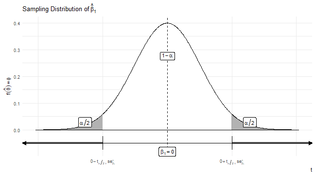

<style type="text/css">
.small .remark-code { /*Change made here*/
  font-size: 85% !important;
}
.tiny .remark-code { /*Change made here*/
  font-size: 50% !important;
}
</style>


# Agenda

1. Estimating Error Variance

2. Hypothesis Testing

3. Controls


---

# Estimating Error Variance

- Ended last lecture talking about $VAR(\hat{\beta}_1) = \frac{\sigma^2}{SST_x}$

  - This is a **conceptual** quantity
  
- How do we actually calculate it?

  - Recall from the univariate case where we wrote $VAR(\bar{Y}) = \frac{\sigma^2}{n}$
  
  - We said it is rare that we actually know $\sigma^2$, but we still estimate it with $S_u^2 = \frac{\sum(y_i - \bar{y})^2}{n-1}$
  
- Here, we do something very similar: $\hat{\sigma}^2 = \frac{\sum(u_i)^2}{n-2} = \frac{SSR}{n-2}$

  - Why $n-2$?
  
---

# Estimating Error Variance

- Thus we plug this into our two formulas for $VAR(\hat{\beta}_0)$ and $VAR(\hat{\beta}_1)$

$$
\begin{aligned}
\widehat{VAR(\hat{\beta}_0)} &= \frac{\hat{\sigma}^2 \frac{\sum x_i^2}{n}}{SST_x}\\
&= \frac{\frac{SSR}{n-2}\frac{\sum x_i^2}{n}}{SST_x}\\
\widehat{VAR(\hat{\beta}_1)} &= \frac{\hat{\sigma}^2}{SST_x}\\
&= \frac{\frac{SSR}{n-2}}{SST_x}\\
\end{aligned}
$$

---

# Estimating Error Variance

- As we discussed last week in the theoretical case, $\hat{\sigma}^2$ is a very interesting quantity, because $\sqrt{\hat{\sigma}^2} = \hat{\sigma} \overset{p}\rightarrow \sigma$

  - $\hat{\sigma}$ is expressed in units of $y$
  
  - Tell us how far the typical fitted value of $y$ is from the observed value
  
  - Theoretically, the extent to which unexplained factors are affecting the value of $y$
  
  - **VERY INFORMATIVE STATISTIC THAT NO ONE REALLY PAYS ATTENTION TO**
  
- Terms for $\hat{\sigma}$:

  - Wooldridge: "standard error of regression" (SER)
  
  - Root MSE or RMSE
  
  - Standard error of the estimate (SEE)
  
  - `R`: Residual standard error


---

# Hypothesis Testing

- Remember all these fun times we had?


---

# Hypothesis Testing

- We now have the tools to do this with $\hat{\beta}_1$! (And $\hat{\beta}_0$, although that is rarely the quantity of interest.)

- Note that we typically are interested in whether $\hat{\beta}_1$ is zero:

  - Null $H_0$: $\beta_1 = 0$
  
  - Alternative $H_A$: $\beta_1 \neq 0$
  
  - Test statistic: Critical $t$ value for Student's T-test for our estimator $\hat{\beta}_1$
  
  - Rejection Region: $\hat{\beta}_1 < 0 - t_{\alpha/2,\nu}*\sqrt{\widehat{VAR(\hat{\beta}_1)}}$ or $\hat{\beta}_1 > 0 + t_{\alpha/2,\nu}*\sqrt{\widehat{VAR(\hat{\beta}_1)}}$
  
---

# Hypothesis Testing

- What is $\sqrt{\widehat{VAR(\hat{\beta}_1)}}$? 

--

  - The **standard error** of the estimator $\hat{\beta}_1$, or $\widehat{se(\hat{\beta}_1)}$, (or often just $se_{\hat{\beta}_1}$)
  
- What is $\nu$?

--

  - The **degrees of freedom**: This will be $n - k - 1$. $n$ observations minus $k$ parameters (in this case just one: $\hat{\beta}_1$) - 1 (for the intercept $\hat{\beta}_0$)

---

# Hypothesis Testing




---


```r
require(tidyverse)
set.seed(123)
n <- 100
X <- rnorm(n)
Y <- rnorm(n,mean = X)

summary(lm(Y~X))
```

```
## 
## Call:
## lm(formula = Y ~ X)
## 
## Residuals:
##     Min      1Q  Median      3Q     Max 
## -1.9073 -0.6835 -0.0875  0.5806  3.2904 
## 
## Coefficients:
##             Estimate Std. Error t value Pr(>|t|)    
## (Intercept) -0.10280    0.09755  -1.054    0.295    
## X            0.94753    0.10688   8.865  3.5e-14 ***
## ---
## Signif. codes:  
## 0 '***' 0.001 '**' 0.01 '*' 0.05 '.' 0.1 ' ' 1
## 
## Residual standard error: 0.9707 on 98 degrees of freedom
## Multiple R-squared:  0.4451,	Adjusted R-squared:  0.4394 
## F-statistic:  78.6 on 1 and 98 DF,  p-value: 3.497e-14
```

---

# Manual Calculation!


```r
b1_hat <- cov(X,Y)/var(X)
b0_hat <- mean(Y) - (cov(X,Y)/var(X))*mean(X)

preds <- b0_hat + b1_hat*X
resids <- Y - preds
mean(resids)
```

```
## [1] -1.621641e-17
```

---

# Manual Calculation!


```r
SSR <- sum(resids^2)
sigma2_hat <- SSR/(n-2)
sigma_hat <- sqrt(sigma2_hat)

SST_x <- sum((X - mean(X))^2)
S_xx <- sum(X^2) - n*mean(X)^2 # Equivalent ways

VAR0_hat <- (sigma2_hat*(sum(X^2)/n))/SST_x
se0_hat <- sqrt(VAR0_hat)

VAR1_hat <- sigma2_hat/SST_x
se1_hat <- sqrt(VAR1_hat)
```

---

# Manual Calculation!


```r
cat(c(b0_hat,se0_hat),'\n',c(b1_hat,se1_hat))
```

```
## -0.1028031 0.09755118 
##  0.9475284 0.1068786
```

```r
summary(lm(Y~X))
```

```
## 
## Call:
## lm(formula = Y ~ X)
## 
## Residuals:
##     Min      1Q  Median      3Q     Max 
## -1.9073 -0.6835 -0.0875  0.5806  3.2904 
## 
## Coefficients:
##             Estimate Std. Error t value Pr(>|t|)    
## (Intercept) -0.10280    0.09755  -1.054    0.295    
## X            0.94753    0.10688   8.865  3.5e-14 ***
## ---
## Signif. codes:  
## 0 '***' 0.001 '**' 0.01 '*' 0.05 '.' 0.1 ' ' 1
## 
## Residual standard error: 0.9707 on 98 degrees of freedom
## Multiple R-squared:  0.4451,	Adjusted R-squared:  0.4394 
## F-statistic:  78.6 on 1 and 98 DF,  p-value: 3.497e-14
```

---

# Other output

- Regression output includes two additional columns

  - `t value` and `Pr(>|t|)`
  
- `t value` is just $\frac{\hat{\beta}_1}{\widehat{se(\hat{\beta}_1)}}$ (or $\frac{\hat{\beta}_0}{\widehat{se(\hat{\beta}_0)}}$)

  - `b1_hat / se1_hat = ` 8.8654627
  
- `Pr(>|t|)` is literally the probably of observing a value as large as the absolute value of the t-value

  - I.e., the $p$**-value**!: "attained significance level" or "smallest level of $\alpha$ for which we would **reject** $H_0$

---

# Controlling for a variable

- We talked last week about OVB (**O**mitted **V**ariable **B**ias)

  - Subset of broader conversation about bias
  
- We might want to "control" for $z$ to remove OVB (preventing the $\beta_2 z_i + \nu_i$ from being "buried in the $u$)

  - But remember that failing to control for $z$ is only a problem **if** either (1) $\beta_2 \neq 0$ or (2) $cov(z,x) \neq 0$
  
- *Ceteris paribus*: "all things being equal"
  
  - Want to estimate a *ceteris paribus* relationship between $X$ and $Y$
  
  - What would the relationship look like if all other aspects of our units were the same?
  
  - Commonly invoked for causal claims, but more on that next semester
  
---

# Controlling for a variable

- Let's get precise with our terminology:

  - $Z$ is a potential **confound**
  
  - If $Z$ "confounds" the relationship between $X$ and $Y$, it **renders the relationship spurious**

- How about some examples? 

--

| $X$ | $Y$ | $Z$ | 
| ------------ | ------------------- | -------------------- |
| College degree | Salary at age 25 | Ability |
| Female | Pro-Choice | Democrat |
| First-born | IQ Score | Parental involvement | 
| Asian-American | Trump Support | Vietnamese | 
| Own a home | Participated in Women's March | Year of Birth |
| ... | ... | ... |

---

# Controlling for a variable

- To determine whether $Z$ renders the relationship between $X$ and $Y$ spurious, we...

  - "control for $Z$"
  
  - "condition on $Z$"
  
  - "hold $Z$ constant"
  
- These all mean the same thing conceptually, but there are several different ways to do this

- Ideally, we would do exactly what "holding $Z$ constant" suggests: divide our units by categories of $Z$ and examine the relationship between $X$ and $Y$ within each category of $Z$

  - I.e., if women are more pro-choice, we want to see this among *both* Democrats and Republicans
  
  - If the relationship persists after holding $Z$ constant, we say it is not spurious
  
  - If it no longer holds, we say that $Z$ is a confound rendering the relationship between $X$ and $Y$ spurious
  
- In practice, we usually do something much less careful

---

# Controlling for a variable

- We often will make our assumptions explicit with a **D**irected **A**cyclic **G**raph (DAG)

  - This encodes our intuition about what the population parameters of interest might be


---

# Controlling for a variable

- Let's tackle a classic: education and income

  - $Y$: income
  
  - $X$: education
  
- What is $Z$?

--

  - Parent's education?

---

# Controlling for a variable

- Start by looking at all three relationships separately


