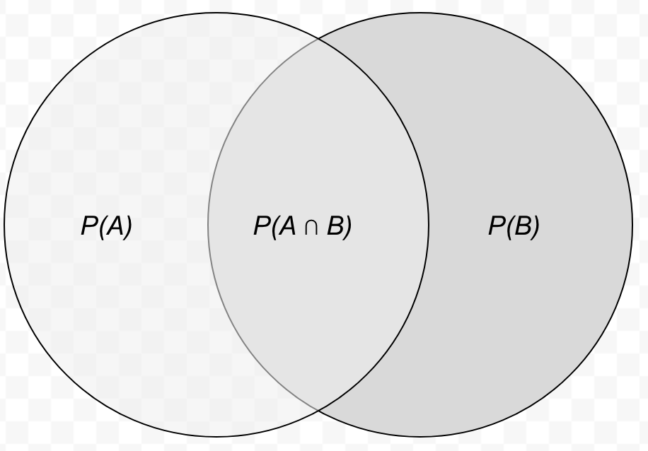

```{css,echo = F}
.small .remark-code { /*Change made here*/
  font-size: 85% !important;
}
.tiny .remark-code { /*Change made here*/
  font-size: 50% !important;
}
```

```{r,include=F}
set.seed(123)
options(width=60)
knitr::opts_chunk$set(fig.align='center',fig.width=9,fig.height=5)
def.chunk.hook  <- knitr::knit_hooks$get("chunk")
knitr::knit_hooks$set(chunk = function(x, options) {
  x <- def.chunk.hook(x, options)
  ifelse(options$size != "normalsize", paste0("\n \\", options$size,"\n\n", x, "\n\n \\normalsize"), x)
})
require(tidyverse)
```

# Agenda

0. Finishing up lecture 1

1. The normal distribution

2. Probability theory

3. Calculating probability

4. Bayes' Rule

---

# Recap

- Three types of empirical questions

--

  - What can we say about the data we **have**, the data we **don't have**, and the data we **expect to see**?
  
- Analysis of data tables / data frames

--

  - Rows are **units**, columns are **variables**
  
--

  - **Variables** are logical groupings of mutually exclusive attributes
  
  - Variables take on **values**, which we typically assign numeric **scores** to
  
- Four levels of measurement

--

  - Nominal, ordinal, interval, ratio

---

# Summarizing data: displays

```{r,echo=F}
set.seed(1234)
data.frame(id = paste0(sample(LETTERS,6),sample(LETTERS,6)),
           state = sample(state.abb,6),
           age = round(runif(6,min = 23,max = 30)),
           GPA = round(rnorm(6,mean = 3.9,sd = .1),2))
```

--

- Why not just present this table as is?

--

```{r,echo=F}
set.seed(1234)
data.frame(id = paste0(sample(LETTERS,26),sample(LETTERS,26)),
           state = sample(state.abb,26),
           age = round(runif(26,min = 23,max = 30)),
           GPA = round(rnorm(26,mean = 3.9,sd = .1),2))
```

---

# Summarizing data: displays

- Fundamental tension in quantitative analysis: **detail versus parsimony**

--

- Use a frequency table?

```{r,echo=F}
set.seed(1234)
data.frame(id = paste0(sample(LETTERS,26),sample(LETTERS,26)),
           state = sample(state.abb,26),
           age = round(runif(26,min = 23,max = 30)),
           GPA = round(rnorm(26,mean = 3.9,sd = .1),2)) %>%
  count(age) %>%
  arrange(n)
```

---

# Summarizing data: displays

- What about for GPA?

--

```{r,echo=F}
set.seed(1234)
data.frame(id = paste0(sample(LETTERS,26),sample(LETTERS,26)),
           state = sample(state.abb,26),
           age = round(runif(26,min = 23,max = 30)),
           GPA = round(rnorm(26,mean = 3.9,sd = .1),4)) %>%
  # mutate(GPA = factor(ifelse(GPA < 3.8,'<3.8',
  #                     ifelse(GPA < 3.9,'3.8-3.9',
  #                            ifelse(GPA < 4,'3.9-4','>4.0'))),
  #                     levels = c('<3.8','3.8-3.9','3.9-4','>4.0'))) %>%
  count(GPA)
```

---

# Summarizing data: displays

- **Recode** data into categories, then use a frequency table

--

```{r,echo=F}
set.seed(1234)
data.frame(id = paste0(sample(LETTERS,26),sample(LETTERS,26)),
           state = sample(state.abb,26),
           age = round(runif(26,min = 23,max = 30)),
           GPA = round(rnorm(26,mean = 3.9,sd = .1),2)) %>%
  mutate(GPA = factor(ifelse(GPA < 3.8,'<3.8',
                      ifelse(GPA < 3.9,'3.8-3.9',
                             ifelse(GPA < 4,'3.9-4','>4.0'))),
                      levels = c('<3.8','3.8-3.9','3.9-4','>4.0'))) %>%
  count(GPA)
```

---

# Summarizing data: displays

- Also can visualize with a **plot**

```{r,echo=F}
set.seed(1234)
data.frame(id = paste0(sample(LETTERS,26),sample(LETTERS,26)),
           state = sample(state.abb,26),
           age = round(runif(26,min = 23,max = 30)),
           GPA = round(rnorm(26,mean = 3.9,sd = .1),2)) %>%
  mutate(GPA = factor(ifelse(GPA < 3.8,'<3.8',
                      ifelse(GPA < 3.9,'3.8-3.9',
                             ifelse(GPA < 4,'3.9-4','>4.0'))),
                      levels = c('<3.8','3.8-3.9','3.9-4','>4.0'))) %>%
  count(GPA) %>%
  ggplot(aes(x = GPA,y = n)) + 
  geom_bar(stat = 'identity')
```

---

# Summarizing data: central tendency

- **Central Tendency**: The *typical value*

--

  - **Mode**: most frequently observed value (which levels of measurement (LOM)?)
  
  - **Median**: value of smallest observation for which the cumulative percentage is $\geq$ 50 (which LOM?)
  
  - **Mean**: average $\bar{y} = \frac{1}{N} \sum_{i = 1}^N y_i$ (which LOM?)
  
---

# Summarizing data: dispersion

- **Dispersion**: The *spread*

--

  - **Range**: difference between smallest and largest values (LOM?)
  
  - **IQR**: difference between 75th%ile and 25%ile (LOM?)
  
  - **Variance**: $s^2 = \frac{1}{N} \sum_{i = 1}^N (y_i - \bar{y})^2$ (LOM?)
  
---

# Summarizing data: qualitative description

- Frequency distribution may be "symmetric" or "skewed"

--

  - Median is typically better than mean if data is skewed (why?)
  
```{r,echo=F,warning=F,message=F}
data.frame(x = rbeta(10000,5,2)) %>%
  mutate(mean = mean(x),
         median = median(x)) %>%
  ggplot(aes(x = x)) + 
  geom_histogram(alpha = .5) + 
  geom_vline(aes(xintercept = mean),linetype = 'dashed') +
  geom_vline(aes(xintercept = median),linetype = 'dotted',color = 'red') +
  labs(title = 'Left-Skewed distribution')
```

---

# Summarizing data: qualitative description

- Frequency distribution may be "symmetric" or "skewed"

  - Median is typically better than mean if data is skewed (why?)
  
```{r,echo=F,warning=F,message=F}
data.frame(x = rbeta(10000,2,5)) %>%
  mutate(mean = mean(x)) %>%
  ggplot(aes(x = x)) + 
  geom_histogram(alpha = .5) + 
  geom_vline(aes(xintercept = mean),linetype = 'dashed') + 
  labs(title = 'Right-Skewed distribution')
```

---

# Summarizing data: qualitative description
  
- Frequency distribution may be "symmetric" or "skewed"

  - Median is typically better than mean if data is skewed (why?)

- Qualitative descriptions can be quantified

--

  - I.e., skew $g_1 = \frac{1}{N*s^3} \sum_{i = 1}^N (y_i - \bar{y})^3$
  
  - If $g_1 = 0$, symmetric
  
  - If $g_1 < 0$, skewed left
  
  - If $g_1 > 0$, skewed right
  
---

# Summarizing data: qualitative description
  
- May be "unimodal" or "bimodal"

```{r,echo=F,warning=F,message=F}
data.frame(x = c(rnorm(10000,mean = 70,sd = 3),
                 rnorm(10000,mean = 63.5,sd = 3)),
           grp = c(rep('M',10000),
                   rep('F',10000))) %>%
  mutate(mean = mean(x)) %>%
  ggplot(aes(x = x)) + 
  geom_histogram(alpha = .5,position = 'identity') + 
  geom_vline(aes(xintercept = mean),linetype = 'dashed') + 
  labs(title = 'Bimodal distribution')
```


---

# Summarizing data: qualitative description
  
- May be "unimodal" or "bimodal"

```{r,echo=F,warning=F,message=F}
data.frame(x = c(rnorm(10000,mean = 70,sd = 3),
                 rnorm(10000,mean = 63.5,sd = 3)),
           grp = c(rep('M',10000),
                   rep('F',10000))) %>%
  group_by(grp) %>%
  mutate(mean = mean(x)) %>%
  ggplot(aes(x = x,fill = grp)) + 
  geom_histogram(alpha = .5,position = 'identity') + 
  geom_vline(aes(xintercept = mean),linetype = 'dashed') + 
  labs(title = 'Bimodal distribution')
```

---

# The Normal Distribution

- Bell shaped?

--

  - Unimodal
  
  - Symmetric
  
--

- Describes many empirical distributions we observe

--

```{r}
require(tidyverse)
x <- rnorm(n = 1000,mean = 63.5,sd = 3)

p <- data.frame(x = x) %>%
  ggplot(aes(x = x)) + 
  geom_histogram(alpha = .3,color = 'grey30') + 
  labs(x = 'Height (inches)',
       y = 'Number of women',
       title = 'An example of a normally distributed variable',
       subtitle = 'Distribution of height of women in the US, 1000 samples') + 
  theme_bw()
```

---

# The Normal Distribution

```{r,message=F,echo=F}
p
```

---

# The Normal Distribution

- Your cousin's best friend's new roommate is 69.5 inches tall

--

  - She is taller than what proportion of women in the American population?

--

```{r,message=F,echo=F}
p + 
  geom_vline(xintercept = 69.5)
```

---

# The Normal Distribution

- Your cousin's best friend's new roommate is 69.5 inches tall

  - She is taller than what proportion of women in the American population?

- Tchebysheff's Theorem:

  - $\bar{y} \pm s$ contains **approximately** 68% of observations
  
  - $\bar{y} \pm 2s$ contains **approximately** 95% of observations
  
  - $\bar{y} \pm 3s$ contains **approximately** all of the observations

---

# The Normal Distribution

.pull-left[
```{r}
p <- data.frame(x = x) %>%
  ggplot(aes(x = x)) + 
  geom_histogram(alpha = .3,color = 'grey30') + 
  labs(x = 'Height (inches)',
       y = 'Number of women',
       title = 'An example of a normally distributed variable',
       subtitle = 'Distribution of height of women in the US, 1000 samples') + 
  geom_vline(xintercept = 69.5,color = 'red',linetype = 'dashed') + 
  annotate(geom = 'text',x = 69.5,y = Inf,label = "Roomate's height = 69.5 inches",
           angle = 90,hjust = 1,vjust = -.15) + 
  theme_bw()
```
]

.pull-right[
```{r,warning=F,echo=F,message=F}
p
```
]

---

# The Normal Distribution

- Can calculate it manually

.pull-left[
```{r}
est <- mean(x < 69.5)
```
]

.pull-right[
```{r,echo=F}
est
```
]

--

- Why is it not exact?

.pull-left[
```{r}
est <- mean(rnorm(n = 10000,mean = 63.5,sd = 3) < 69.5)
```
]

.pull-right[
```{r,echo=F}
est
```
]

--

- Preview of the **Law of Large Numbers**

.pull-left[
```{r}
est <- mean(sapply(1:1000,function(x) mean(rnorm(n = 1000,mean = 63.5,sd = 3) < 69.5)))
```
]

.pull-right[
```{r,echo=F}
est
```
]

---

# The Normal Distribution

- The **mean** of independently drawn observations from **any** populations tends toward the Normal Distribution

--

- This creates lots of Normal Distributions!

--

  - **However**, do NOT make the mistake of assuming all distributions are normal
  

---

# Samples versus Populations

- **NB:** We have been using a **sample**

  - `rnorm()` samples from the normal distribution
  
```{r,message=F,echo=F,warning=F}
ggplot(data = data.frame(x = c(45, 80)), aes(x)) +
  stat_function(fun = dnorm, n = 101, args = list(mean = 63.5, sd = 3)) + ylab("") +
  geom_vline(xintercept = 69.5)
```

---

# Samples versus Populations

- **NB:** We have been using a **sample**

  - `rnorm()` samples from the normal distribution

- Taking data as given, resisted making **inferences** to a population

--

  - That's the next big step, but we need to first get familiar with **Probability Theory**
  
---

# Probability Theory: The Logic

--

- Familiar with moving from populations to samples

--

  - Given a 52 card deck with 13 spades, what is the probability of drawing a spade at random from a perfectly shuffled deck?
  
--
  
  - **Population**: 52 card deck with 13 spades
  
  - **Sample**: draw a card a random
  
--

  - 1/4: we know the distribution of spades in the population, and we are precise about sampling process
  
---

# Probability Theory; The Logic

- Run it in reverse!

--

- We know the sample

--

  - Central tendency ( $\bar{y}$ )
  
  - Dispersion ( $s^2$ )
  
--

- Make assumptions about sampling process to make **good** guesses about the population's central tendency ( $\mu$ ) and dispersion ( $\sigma^2$ )

--

- Learn the tools of the **population-to-sample** process to understand the **sample-to-population** process

---

# A Probabilistic Model for an Experiment

- **Experiments** describe the *process by which an observation is made*

--

- An **observation** is a quantity of interest:

--

  - The price of a stock
  
  - The number of subjects who choose "A" instead of "B"
  
  - The proportion of respondents who approve of Biden's job as president
  
--

- Experiments produce outcomes called **events**

---

# Example of an Experiment

- Election in a country with 101 voters; majority rule; everyone votes for either A or B

--

  - Possible **events**?

--

  a. Candidate A wins
  
  b. Candidate B wins
  
  c. Candidate A wins with 76 votes
  
  d. Candidate B wins with 56 votes
  
  e. Candidate A wins in a "landslide" ( $\geq 67$ votes)
  
  - Others?
  
--

- Note that a. can be decomposed into several other events

--

  a.1 Candidate A wins with 51 votes
  
  a.2 Candidate A wins with 52 votes
  
  a...
  
---

# Example of an Experiment

- Types of events

--

  - **Compound**: a., b., and e.
  
  - **Simple**: c. and d.
  
--

- **Set theory**

--

  - Associate a distinct point -- a **sample** point -- with each simple event
  
  - Refer to simple event $i$ as $E_i$
  
--

- **Sample space $S$**: set of all possible sample points

--

- How many in this example?

--

- $S = \{E_1, E_2, \dots E_{102}\}$

---

# Set Theory

- $S$ consists of countable (finite) number of sample points

--

  - **Discrete sample space**
  
  - Sample points are mutually exclusive
  
--

- Compound events are sets of sample points

--

  - "A wins by a landslide" occurs if one of $E_{68},\dots,E_{102}$ occurs
  
  - $A = \{E_{68},\dots,E_{102}\}$
  
--

- Thus an **event** is a collection of sample points

--

  - A subset of $S$
  
- *Aside on set theory notation*
  
---

# Probabilities in Set Theory

- Assign a number $P(A)$ to each event $A$ in $S$ 

--

- Three axioms of probability give structure to this assignment

--

  1. $P(A) \geq 0$
  
  2. $P(S) = 1$
  
  3. $P(A_1 \cup A_2 \cup A_3 \cup \dots A_n) = \sum_{i=1}^n P(A_i)$
  
--

- With these axioms in hand, $P(A)$ is defined as the **probabilities of $A$**

---

# Calculating Probability of Event

- **Sample point** method

--

  - Define experiment and sample space $S$
  
  - Assign reasonable probabilities to sample points s.t. $P(E_i) \geq 0$ and $\sum_i P(E_i) = 1$
  
  - For $A = E_{i_1} \cup E_{i_2} \cup \dots E_{i_J}$, calculate $P(A) = \sum_{j}^J P(E_{i_j})$
  
--

- **Event composition** method

--

  - Decompose and compose event $A$ into **unions** and **intersections** of events with conveniently calculated probabilities


---

# Event Composition Method

- Need four tools

--

  1. Definitions of **conditional probability** and **independence**
  
  2. **Multiplicative** and **additive** laws
  
  3. Probability of an event and its **complement**
  
  4. The **law of total probability** and **Bayes' Rule**
  
--

- Before this, recall that

--

  - $A \cap B$: compound event where *both* $A$ and $B$ happen (AND)
  
  - $A \cup B$: compound event where *either* $A$ or $B$ happens, or both (OR)
  
---

# 1. Definitions

- **Conditional probability**: $P(A|B) = \frac{P(A\cap B)}{P(B)}$
  
- **Independence**: For two events $A$ and $B$, if *any one* of the following conditions holds:

  - $P(A|B) = P(A)$
  
  - $P(B|A) = P(B)$
  
  - $P(A\cap B) = P(A)P(B)$
  
- then $A$ and $B$ are *independent* events

- If none hold, then $A$ and $B$ are dependent events

---

# 2. Laws

- **Multiplicative law** (intersection)

--

  - $P(A\cap B) = P(A)P(B|A) = P(B)P(A|B)$ **OR**
  
  - $P(A\cap B) = P(A)P(B)$ if $A$ and $B$ are independent events
  
--

  - For three events $P(A_1 \cap A_2 \cap A_3) = P(A_1)P(A_2|A_1)P(A_3|A_1\cap A_2)$
  
--

  - For many events $P(A_1 \cap A_2 \cap \dots A_k) = P(A_1)P(A_2|A_1) \dots P(A_k|A_1 \cap A_2 \cap \dots A_{k-1})$
  
--

- **Additive law** (union)

--

  - $P(A\cup B) = P(A) + P(B) - P(A\cap B)$
  
  - If $A$ and $B$ are mutually exclusive, $P(A\cap B) = 0$
  
---

# Aside on a simple proof

- Denote "not $A$" as $A^c$ (sometimes written $\sim A$ or, in WMS, $\bar{A}$ )

- **Complementary events** means that $P(A) = 1 - P(A^c)$

--

- Proof:

  - $S = A \cup A^c$ (given $A \subset S$)
  
  - $P(S) = P(A) + P(A^c)$ (by Axiom 3, since $A$ and $A^c$ are mutually exclusive)
  
  - $1 = P(A) + P(A^c)$ (by Axiom 2)
  
  - $P(A) = 1 - P(A^c) \blacksquare$
  
---

# Example of event composition method

- Randomly assign 16 students into 3 teams of 6, 5, and 5

- 11 of the students are male

- What is the probability that the team of six students (call this "Team 1") is entirely male?

--

1. Define event as "the first six assigned students are male"
  
2. Decompose event into simpler events $A$ through $F$
  
--

  - $A$: First student picked is male
  
  - $B$: Second student picked is male
  
  - $\dots$
  
  - $F$: Sixth student picked is male
  
3. Event occurs iff $A$ through $F$ all occur, meaning $A \cap B \cap C \cap D \cap E \cap F$.

---

# Example contd

- Thus we want $P(A \cap B \cap C \cap D \cap E \cap F)$

--

- How to solve?

--

- **Multiplicative Law**

--

  - $P(A_1 \cap A_2 \cap \dots A_k) = P(A_1)P(A_2|A_1) \dots P(A_k|A_1 \cap A_2 \cap \dots A_{k-1})$
  
  - $P(A_1 \cap A_2 \cap \dots A_6) = P(A_1)P(A_2|A_1) \dots P(A_6|A_1 \cap A_2 \cap \dots A_5)$
  
---

# Example contd

- Step through it

--

  - What is the probability that the first student picked is male? $\frac{11}{16}$
  
  - $P(A_1 \cap A_2 \cap \dots A_6) = \frac{11}{16}P(A_2|A_1) \dots P(A_6|A_1 \cap A_2 \cap \dots A_5)$
  
--

  - What is the probability that the second student picked is male? $\frac{10}{15}$
  
  - $P(A_1 \cap A_2 \cap \dots A_6) = \frac{11}{16} \cdot \frac{10}{15}P(A_3|A_1 \cap A_2) \dots P(A_6|A_1 \cap A_2 \cap \dots A_5)$
  
--

- And so on

  - $P(A_1 \cap A_2 \cap \dots A_6) = \frac{11}{16} \cdot \frac{10}{15} \cdot \frac{9}{14} \cdot \frac{8}{13} \cdot \frac{7}{12} \cdot \frac{6}{11} = \frac{3}{52}$
  
---

# Factor notation

- Note that the product of the numerators is $11 \cdot 10 \cdot \dots \cdot 2 \cdot 1$ except we remove the final five multiplicands

- Same as $\frac{11 \cdot 10 \cdot \dots \cdot 2 \cdot 1}{5 \cdot 4 \cdot 3 \cdot 2 \cdot 1}$ which is $\frac{11!}{5!}$

- Similarly, denominator can be written as $\frac{10!}{16!}$

- Thus $P(A_1 \cap A_2 \cap \dots A_6) = \frac{11!}{5!} \cdot \frac{10!}{16!}$
  
---

# Law of Total Probability

- In a discrete sample space $S$, we can define $S$ as the union of $k$ mutually exclusive events

--

  - $S = B_1 \cup B_2 \cup \dots B_k$, where
  
  - $B_i \cap B_j = \varnothing, \forall i \neq j$
  
- Note that a collection of sets $\{B_1, B_2, \dots B_k\}$  is a **partition** of $S$ iff
  
--

  - their union is $S$ and
  
  - they are themselves mutually exclusive
  

---

# Law of Total Probability

- If $A$ is a subset of $S$, it can be **decomposed** as the union of its intersections with each of the partitions of $S$ as follows:

--

  - $A = (A \cap B_1) \cup (A \cap B_2) \cup \dots (A \cap B_k)$

--

- If $\{B_1, B_2, \dots B_k\}$ is a partition of $S$ such that $P(B_i) > 0 \forall i = 1,2,\dots k$

- then the **Law of Total Probability** states:

--

  - $P(A) = \sum_{i=1}^k P(A|B_i)P(B_i)$
  
---

# Bayes' Rule

- $P(B_j|A) = \frac{P(A\cap B_j)}{P(A)}$

- Substitute the definition into the numerator and the Law of Total Probability into the denominator

- $P(B_j|A) = \frac{P(A|B_j)P(B_j)}{\sum_{i=1}^k P(A|B_i)P(B_i)}$

---

# Bayes' Rule

- Simpler example with two sets

- $P(B|A) = \frac{P(A|B)P(B)}{P(A|B)P(B) + P(A|B^c)P(B^c)}$

<center></center>


---

# Bayes' Rule

- Example time!

- WMS 2.124, pg. 73: "A population of voters contains 40% Republicans and 60% Democrats. It is reported that 30% of the Republicans and 70% of the Democrats favor an election issue. A person chosen at random from this population is found to favor the issue in question. Find the conditional probability that this person is a Democrat."

- WMS 2.125, pg. 73: "A diagnostic test for a disease is such that it (correctly) detects the disease in 90% of the individuals who actually have the disease. Also, if a person does not have the disease, the test will report that he or she does not have it with probability .9. Only 1% of the population has the disease in question. If a person is chosen at random from the population and the diagnostic test indicates that she has the disease, what is the conditional probability that she does, in fact, have the disease? Are you surprised by the answer? Would you call this diagnostic test reliable?"

```{r,message=F,echo=F,warning=F,results='hide'}
dir <- getwd()
type <- 'pdf'
format <- 'landscape'
f <- 'Lecture_2_slides'

system(paste('Rscript ./chromeprint.R',dir,type,format,f),wait = F)
```