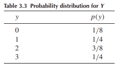

```{css,echo = F}
.small .remark-code { /*Change made here*/
  font-size: 85% !important;
}
.tiny .remark-code { /*Change made here*/
  font-size: 50% !important;
}
```

```{r,include=F}
set.seed(123)
options(width=60)
knitr::opts_chunk$set(fig.align='center',fig.width=9,fig.height=5)
def.chunk.hook  <- knitr::knit_hooks$get("chunk")
knitr::knit_hooks$set(chunk = function(x, options) {
  x <- def.chunk.hook(x, options)
  ifelse(options$size != "normalsize", paste0("\n \\", options$size,"\n\n", x, "\n\n \\normalsize"), x)
})
require(tidyverse)
```

# Agenda

1. Finishing up lecture 2

2. Random variables

3. Probability distributions

4. Expectations

5. Theoretical probability models

---

# Calculating Probability of Event

- **Sample point** method

--

  - Define experiment and sample space $S$
  
  - Assign reasonable probabilities to sample points s.t. $P(E_i) \geq 0$ and $\sum_i P(E_i) = 1$
  
  - For $A = E_{i_1} \cup E_{i_2} \cup \dots E_{i_J}$, calculate $P(A) = \sum_{j}^J P(E_{i_j})$
  
--

- **Event composition** method

--

  - Decompose and compose event $A$ into **unions** and **intersections** of events with conveniently calculated probabilities


---

# Event Composition Method

- Need four tools

--

  1. Definitions of **conditional probability** and **independence**
  
  2. **Multiplicative** and **additive** laws
  
  3. Probability of an event and its **complement**
  
  4. The **law of total probability** and **Bayes' Rule**
  
--

- Before this, recall that

--

  - $A \cap B$: compound event where *both* $A$ and $B$ happen (AND)
  
  - $A \cup B$: compound event where *either* $A$ or $B$ happens, or both (OR)
  
---

# 1. Definitions

- **Conditional probability**: $P(A|B) = \frac{P(A\cap B)}{P(B)}$
  
- **Independence**: For two events $A$ and $B$, if *any one* of the following conditions holds:

  - $P(A|B) = P(A)$
  
  - $P(B|A) = P(B)$
  
  - $P(A\cap B) = P(A)P(B)$
  
- then $A$ and $B$ are *independent* events

- If none hold, then $A$ and $B$ are dependent events

---

# 2. Laws

- **Multiplicative law** (intersection)

--

  - $P(A\cap B) = P(A)P(B|A) = P(B)P(A|B)$ **OR**
  
  - $P(A\cap B) = P(A)P(B)$ if $A$ and $B$ are independent events
  
--

  - For three events $P(A_1 \cap A_2 \cap A_3) = P(A_1)P(A_2|A_1)P(A_3|A_1\cap A_2)$
  
--

  - For many events $P(A_1 \cap A_2 \cap \dots A_k) = P(A_1)P(A_2|A_1) \dots P(A_k|A_1 \cap A_2 \cap \dots A_{k-1})$
  
--

- **Additive law** (union)

--

  - $P(A\cup B) = P(A) + P(B) - P(A\cap B)$
  
  - If $A$ and $B$ are mutually exclusive, $P(A\cap B) = 0$
  
---

# Aside on a simple proof

- Denote "not $A$" as $A^c$ (sometimes written $\sim A$ or, in WMS, $\bar{A}$ )

- **Complementary events** means that $P(A) = 1 - P(A^c)$

--

- Proof:

  - $S = A \cup A^c$ (given $A \subset S$)
  
  - $P(S) = P(A) + P(A^c)$ (by Axiom 3, since $A$ and $A^c$ are mutually exclusive)
  
  - $1 = P(A) + P(A^c)$ (by Axiom 2)
  
  - $P(A) = 1 - P(A^c) \blacksquare$
  
---

# Example of event composition method

- Randomly assign 16 students into 3 teams of 6, 5, and 5

- 11 of the students are male

- What is the probability that the team of six students (call this "Team 1") is entirely male?

--

1. Define event as "the first six assigned students are male"
  
2. Decompose event into simpler events $A$ through $F$
  
--

  - $A$: First student picked is male
  
  - $B$: Second student picked is male
  
  - $\dots$
  
  - $F$: Sixth student picked is male
  
3. Event occurs iff $A$ through $F$ all occur, meaning $A \cap B \cap C \cap D \cap E \cap F$.

---

# Example contd

- Thus we want $P(A \cap B \cap C \cap D \cap E \cap F)$

--

- How to solve?

--

- **Multiplicative Law**

--

  - $P(A_1 \cap A_2 \cap \dots A_k) = P(A_1)P(A_2|A_1) \dots P(A_k|A_1 \cap A_2 \cap \dots A_{k-1})$
  
  - $P(A_1 \cap A_2 \cap \dots A_6) = P(A_1)P(A_2|A_1) \dots P(A_6|A_1 \cap A_2 \cap \dots A_5)$
  
---

# Example contd

- Step through it

--

  - What is the probability that the first student picked is male? $\frac{11}{16}$
  
  - $P(A_1 \cap A_2 \cap \dots A_6) = \frac{11}{16}P(A_2|A_1) \dots P(A_6|A_1 \cap A_2 \cap \dots A_5)$
  
--

  - What is the probability that the second student picked is male? $\frac{10}{15}$
  
  - $P(A_1 \cap A_2 \cap \dots A_6) = \frac{11}{16} \cdot \frac{10}{15}P(A_3|A_1 \cap A_2) \dots P(A_6|A_1 \cap A_2 \cap \dots A_5)$
  
--

- And so on

  - $P(A_1 \cap A_2 \cap \dots A_6) = \frac{11}{16} \cdot \frac{10}{15} \cdot \frac{9}{14} \cdot \frac{8}{13} \cdot \frac{7}{12} \cdot \frac{6}{11} = \frac{3}{52}$
  
---

# Factor notation

- Note that the product of the numerators is $11 \cdot 10 \cdot \dots \cdot 2 \cdot 1$ except we remove the final five multiplicands

- Same as $\frac{11 \cdot 10 \cdot \dots \cdot 2 \cdot 1}{5 \cdot 4 \cdot 3 \cdot 2 \cdot 1}$ which is $\frac{11!}{5!}$

- Similarly, denominator can be written as $\frac{10!}{16!}$

- Thus $P(A_1 \cap A_2 \cap \dots A_6) = \frac{11!}{5!} \cdot \frac{10!}{16!}$
  
---

# Law of Total Probability

- In a discrete sample space $S$, we can define $S$ as the union of $k$ mutually exclusive events

--

  - $S = B_1 \cup B_2 \cup \dots B_k$, where
  
  - $B_i \cap B_j = \varnothing, \forall i \neq j$
  
- Note that a collection of sets $\{B_1, B_2, \dots B_k\}$  is a **partition** of $S$ iff
  
--

  - their union is $S$ and
  
  - they are themselves mutually exclusive
  

---

# Law of Total Probability

- If $A$ is a subset of $S$, it can be **decomposed** as the union of its intersections with each of the partitions of $S$ as follows:

--

  - $A = (A \cap B_1) \cup (A \cap B_2) \cup \dots (A \cap B_k)$

--

- If $\{B_1, B_2, \dots B_k\}$ is a partition of $S$ such that $P(B_i) > 0 \forall i = 1,2,\dots k$

- then the **Law of Total Probability** states:

--

  - $P(A) = \sum_{i=1}^k P(A|B_i)P(B_i)$
  
---

# Bayes' Rule

- $P(B_j|A) = \frac{P(A\cap B_j)}{P(A)}$

- Substitute the definition into the numerator and the Law of Total Probability into the denominator

- $P(B_j|A) = \frac{P(A|B_j)P(B_j)}{\sum_{i=1}^k P(A|B_i)P(B_i)}$

---

# Bayes' Rule

- Simpler example with two sets

- $P(B|A) = \frac{P(A|B)P(B)}{P(A|B)P(B) + P(A|B^c)P(B^c)}$

<center></center>

---

# Bayes' Rule

- Classic examples:

  - WMS 2.124, pg. 73: "A population of voters contains 40% Republicans and 60% Democrats. It is reported that 30% of the Republicans and 70% of the Democrats favor an election issue. A person chosen at random from this population is found to favor the issue in question. Find the conditional probability that this person is a Democrat."

  - WMS 2.125, pg. 73: "A diagnostic test for a disease is such that it (correctly) detects the disease in 90% of the individuals who actually have the disease. Also, if a person does not have the disease, the test will report that he or she does not have it with probability .9. Only 1% of the population has the disease in question. If a person is chosen at random from the population and the diagnostic test indicates that she has the disease, what is the conditional probability that she does, in fact, have the disease? Are you surprised by the answer? Would you call this diagnostic test reliable?"

---

# One additional tool

- Assigning probabilities in a sample space consisting of **equiprobable events**

- $S$ consists of $n$ **equiprobable** events $E$ such that $P(E_1) = P(E_2) = \dots = P(E_n)$

  - Recall we define $A$ as a subset of $S$: some subset of sample points that make up $S$
  
  - Then $P(A) = \frac{|A|}{n}$ where $|A|$ indicates the number of elements in $A$
  
---

# Quick recap

- We now have an intellectual foundation for probability

  - Probabilistic events in the context of an **experiment** and **simple events**
  
  - All possible events define the **sample space**
  
  - 3 axioms for how to assign probabilities to events
  
  - 4 tools to decompose and compose events of interest
  

---

# Random Variables

- Experiment where events of interest are **numerical**

  - Identified in a meaningful way by numbers
  
  - I.e., number of seats held by Republican Party in the House after a midterm election
  
  - We assign a *real number* to each point in the sample space
  
  - Call this number the variable $Y$
  
- What is a variable?

--

  - A logical grouping of attributes
  
  - Take on values that are **exhaustive** and **mutually exclusive**

--

- Thus each sample point can only take on one value of $Y$, but the same values of $Y$ may be assigned to multiple sample points

---

# Functions

- We **map** numeric values using a **function**

- Thus the numeric random variable $Y$ is a **function** of the sample points in $S$

- A function is a mathematical relation assigning each element of one set (the source) to one and only one element of another set (the target)

  - The function's **source** is $S$ and its **target** is $Y$
  
  - $f: S \rightarrow Y$
  
  - This function (and by extension, $Y$) is a **random variable**
  
- Whenever we talk about a random variable, *we are really talking about a function* that maps each simple event in a sample space $S$ to a meaningful number

---

# Notation

- Random variables expressed with capital letters: i.e., $Y$

- Interested in the probability a random variable takes on some value

  - Probability that $Y = 0$ written as $P(Y = 0)$
  
- Denote observed or hypothetical values of $Y$ with lowercase letters

  - $P(Y = y)$
  
- Still fundamentally interested in **events of interest** $A$, but denote with numbers $a$

  - $A \equiv \{\text{all sample points such that }Y = a\}$
  
---

# Quick Detour: Random Samples

- Our experiment is the drawing of a **sample** from a population

  - **Sample**: the units selected for analysis
  
  - **Population**: the group of units about which we want to make inferences
  
- The **design** of our experiment is the method of sampling

  - Do we sample *with replacement*? Units are put back into the population after being sampled, and we might re-sample them again

---

# Quick Detour: Random Samples
  
- Most common design is **random sampling**

  - Let $N$ be the number of elements in the population and $n$ be the number of elements in our sample
  
  - How many different samples without replacement can we draw?
  
--

  - $\bigg(\frac{N}{n}\bigg) = \frac{N!}{n!(N - n)!}$
  
  - If we draw these $n$ elements with equal probability, this is a **random sample**
  
---

# Back to RVs: Probability Distributions

- Start with **discrete** random variables

  - $Y$ is discrete if it can only take on finite or countably infinite number of distinct values
  
  - "Countably infinite": a one-to-one correspondence with the integers
  
- To make inferences about the **population** based on a **sample**:

  - Need to know the probability of observing a particular event
  
    - Events are numerical events corresponding to values $y$ of discrete random variables $Y$
    
  - $P(Y = y)$ for all the values $Y$ can take on
  
  - The collection of these probabilities is a **probability distribution**
  
---

# Example: dice

- Experiment: roll a pair of six-sided dice and record the sum of their faces

  - Sample space consists of 36 simple events
  
  - Random variable $Y$ is the sum of the faces
  
  - $P(Y = y) = \sum_{E_i: Y(E_i) = y}P(E_i)$
  
  - Sometimes written as $p(y)$
  
- Can express $Y$'s probability distribution as a **table**, a **formula**, or a **graph**

---

# Probability Distribution: Table

```{r,echo=F,message=F,warning=F}
require(tidyverse)
p <- data.frame(y = 2:12,
           samples = c(1:6,5:1)) %>%
  mutate(Pr_y = samples / sum(samples))
p
```

---

# Probability Distribution: Graph

```{r}
p %>%
  ggplot(aes(x = y,y = Pr_y)) + 
  geom_bar(stat = 'identity')
```

---

# Probability Distribution: Function

$$P(Y = y) = p(y) = \frac{6 - |7-y|}{36},\; y = \{1,2,\dots,6\}$$

- Also called a **probability mass function** or **PMF**

  - The "mass of a random variable at $y$" is the PMF evaluated at $y$, or $p(y)$
  
- The probability distribution of a random variable is a **theoretical model** for the empirical distribution of data associated with a real population

  - If we roll a pair of dice over and over again, the empirical distribution would look *like* (but not *identical to*) the theoretical probability distribution
  
---

# Expectations

- We can summarize a random variable with its central tendency and dispersion
  
- We can specify and manipulate formulas describing random variables using the **expectations operator**

  - **Expected value** of $Y$ is $E(Y) \equiv \sum_y yp(y)$
  
  - Each possible value of $Y$ multiplied by the probability of it appearing, summed up over all $y$
  
  - Apply this to the dice example!
  
- The **expected value** is how we talk about the central tendency of a random variable with a theoretical probability distribution

  - Equivalent to the concept of the *mean of an empirical frequency distribution*
  
---

# Expectations

- Recall that the probability distribution of a random variable is a *theoretical model* for the empirical distribution of data **associated with a real population**

  - If the theoretical model is **accurate**, then $E(Y) = \mu$
  
- $\mu$ is the **population mean** which is a "parameter"
  
  - **Parameter**: characteristic of the distribution $Y$ in the population that we never actually observe
  
---

# Expectations

- The expected value concept can be applied to any **function of a random variable**

  - Consider any real-valued function of $Y$, denoted $g(Y)$
  
  - $E[g(Y)] = \sum_y g(y)p(y)$
  
- Instead of summing over the discrete values of $y$ multiplied by their probability $p(y)$, we are summing over the discrete values of $y$ that are transformed with the function $g(y)$

- NB: $E[g(Y)] = \sum_y g(y)p(y)$ is not a definition. We have to **prove** it.

---

# A proof

- Denote a random variable $Y$ taking on $n$ values $y_1, y_2, \dots, y_n$

- Denote a function $g(y)$ that takes on $m$ different values $g_1, g_2, \dots, g_m,\; m\leq n$

- Note that $g(Y)$ is itself a random variable

  - This means we can denote a new probability function $p^*$ that describes the probability that $g$ takes on a value $g_i$
  
  - $p^*(g_i) = P[g(Y) = g_i]$
  
  - $p^*(g_i) = \sum_{y_j:g(y_j) = g_i} p(y_j)$
  
  - Definition: $y_j:g(y_j) = g_i$ means "all $y_j$ such that $g = g_i$ when evaluated at $y_j$"
  
---

# Proof contd

- Definition of expected value: $E[g(Y)] = \sum_{i = 1}^m g_ip^*(g_i)$

- Substitute: $E[g(Y)] = \sum_{i = 1}^m g_i \bigg(\sum_{y_j:g(y_j) = g_i} p(y_j)\bigg)$

- Rearrange: $E[g(Y)] = \sum_{i = 1}^m \bigg(\sum_{y_j:g(y_j) = g_i} g_i p(y_j)\bigg)$

- Substitute: $E[g(Y)] = \sum_{i = 1}^m g(y_j) p(y_j)$

- Simplify: $E[g(Y)] = \sum_y g(y)p(y) \blacksquare$

---

# Variance

- Using these tools, we can also define the variance of $Y$

- Remember that the variance of an empirical variable is $s^2 = \frac{1}{N}\sum_{i = 1}^N (y_i - \bar{y})^2$

- Same idea for a random variable!

- $\textit{VAR}(Y) \equiv E[(Y-E(Y))^2]$

- If $Y$ accurately describes the population distribution, then $\textit{VAR}(Y) = E[(Y - \mu)^2]$

- Denote $\textit{VAR}(Y) = \sigma^2$ and the standard deviation of $Y$ is $\sqrt{\sigma^2} = \sigma$

---

# Example

<center></center>

- What is the mean, variance, and standard deviation of $Y$?

--

- Mean: $E(Y) = \sum_{y = 0}^3 yp(y) = (0)(1/8) + (1)(1/4) + (2)(3/8) + (3)(1/4) = 1.75$

- Variance: $\sigma^2 = E[(Y - \mu)^2] = \sum_{y = 0}^3 (y - \mu)^2 p(y)$

  - $(0 - 1.75)^2(1/8) + (1 - 1.75)^2(1/8) + (2 - 1.75)^2(1/8) + (3 - 1.75)^2(1/8) = 0.9375$
  
- Standard deviation: $\sigma = \sqrt{\sigma^2} = \sqrt{0.9375} = 0.97$

---

# Helpful results

- $E(c) = c$

  - Let $g(Y) \equiv c$
  
  - $E(c) = \sum_y cp(y)$
  
  - $E(c) = c\sum_y p(y)$
  
  - Axiom 2: $\sum_y p(y) = 1$
  
  - Thus $E(c) = c\;\blacksquare$
  
---

# Helpful results

- $E[cg(Y)] = cE[g(Y)]$

  - $E[cg(Y)] = \sum_y cg(y)p(y)$
  
  - $E[cg(Y)] = c\sum_y g(y)p(y)$
  
  - $E[cg(Y)] = cE[g(Y)]\; \blacksquare$
  
---

# Helpful results

- We can **distribute expectations**: consider $k = 2$

  - $g_1(Y) + g_2(Y)$ is a function of $Y$: $E[g_1(Y) + g_2(Y)] = \sum_y[g_1(y) + g_2(y)]p(y)$
  
  - $E[g_1(Y) + g_2(Y)] = \sum_y[g_1(y)p(y)] + \sum_y[g_2(y)p(y)]$
  
  - $E[g_1(Y) + g_2(Y)] = E[g_1(Y)] + E[g_2(Y)]\; \blacksquare$
  
---

# Theoretical Probability Models

- Three examples

  - the Bernoulli
  
  - the Binomial
  
  - the Poisson
  
---

# Bernoulli

- A Bernoulli experiment is the *observation of an experiment consisting of one trial with two outcomes: zero or one*

  - $Y = \{0,1\}$
  
  - I.e., coin toss, whether someone approves of Biden's performance, whether a country signs a treaty
  
- A Bernoulli random variable is characterized by one parameter $\pi$: the probability of "success"

- A Bernoulli probability distribution is:

  - $p(y = 1) = \pi$
  
  - $p(y = 0) = 1-\pi$
  
  - Or $p(y) = \pi^y (1-\pi)^{(1-y)}$
  
- Practice proof: show that $E(Y) = \pi$ and $\textit{VAR}(Y) = \pi(1-\pi)$

---

# The Binomial

- A Binomial experiment is the *observation of an experiment consisting of a sequence of identical and independent Bernoulli trials*

  - $Y$ is the number of successes observed during the $n$ trials
  
  - I.e., # of heads observed in $n$ coin tosses, # of people approving of Biden's performance out of $n$ people, # of countries signing a treaty out of $n$ eligible countries
  
- Let's find the Binomial probability distribution!

  - Let our event of interest be $Y = y$ where $y$ is either success or failure ( $S$ or $F$)
  
  - One event might be $S,S,F,S,F,F,F,S,F,S,\dots,F,S$
  
  - Reorder to $S_1,S,S,S,\dots,S,S_y$ and $F_1,F,F,\dots,F,F_{n-y}$
  
  - The number of successes is simply $y$, and the number of failures is $n-y$
  
---

# The Binomial contd

- This event can be expressed with set notation as the **intersection** of $n$ simple events: $S_1 \cap S_2 \cap \dots S_y \cap F_1 \cap F_2 \cap \dots F_{n-y}$

  - These are **independent** events, meaning $P(S_1 \cap S_2 \cap \dots S_y \cap F_1 \cap F_2 \cap \dots F_{n-y}) = P(S_1)P(S_2)\dots P(S_y)P(F_1)P(F_2)\dots P(F_{n-y})$
  
  - This is just $\pi^y(1-\pi)^{n-y}$...same as Bernoulli!
  
  - BUT! Not probability of $Y=y$ because the event $Y=y$ can happen in many different ways than the above order.
  
- How many different ways are there to order $y$ $S$'s and $n-y$ $F$'s?

  - Number of different ways we can choose $y$ elements out of a total of $n$ elements
  
  - $n \choose y$ or $\frac{n!}{y!(n - y)!}$
  
- Thus the Binomial probability distribution is $p(y) = \frac{n!}{y!(n-y)!} \pi^y(1-\pi)^{n-y}$

---

# Example

- 9 students in class, 5 males. If I pick 6 at random with replacement, what is the chance I pick the same number of males and females?

  - Call "success" a female: $\pi = \frac{4}{9}$
  
  - $n = 6$ (number of trials)
  
  - $y = 3$ (number of successes)
  
- Thus $p(Y = 3) = \frac{6!}{3!(6-3)!} \bigg(\frac{4}{9}\bigg)^3\bigg(1 - \frac{4}{9}\bigg)^{6-3} \approx 0.30$

- What if I draw six students at random with replacement, on average how many females will I pick? And how much will this number vary over repeated draws of six?

---

# The Poisson

- A Poisson experiment is *the observation of a count of events that occur in an interval, broadly defined*.

  - An **interval**: a given space, time period, or any other dimension
  
  - I.e., environmental laws per Congressional session
  
  - Errors per page
  
  - Government shutdowns per decade
  
  - Homeless centers per census tract
  
- A Poisson can be understood as a Binomial experiment as the number of trials approaches infinity

---

# The Poisson contd

- Split the interval into $n$ subintervals, each so small that at most one event could occur in it

  - Thus, each subinterval can be thought of as a Bernoulli trial: $p(y) = \pi^y(1-\pi)^{1-y}$
  
  - And $n$ subintervals can be thought of as a Binomial: $p(y) = \frac{n!}{y!(n-y)!} \pi^y(1-\pi)^{n-y}$
  
- How many subintervals are required? Who knows. But we can make them infinitely small by taking the limit of the Binomial as $n \rightarrow \infty$

  - Interested in the number of successes over the interval: $\lambda = n\pi$
  
  - $\lim_{n\rightarrow\infty} \frac{n!}{y!(n-y)!} \pi^y(1-\pi)^{n-y}$
  
  - $\lim_{n\rightarrow\infty} \frac{n!}{y!(n-y)!} \bigg(\frac{\lambda}{n}\bigg)^y \bigg(1 - \frac{\lambda}{n}\bigg)^{n-y}$
  
---

# The Poisson contd

- Note that, by the definition of $e$, $\lim_{n\rightarrow\infty}\bigg(1 - \frac{\lambda}{n}\bigg)^n = e^{-\lambda}$
  - $\lim_{n\rightarrow\infty} \frac{n!}{y!(n-y)!} \bigg(\frac{\lambda}{n}\bigg)^y \bigg(1 - \frac{\lambda}{n}\bigg)^{n} \bigg(1 - \frac{\lambda}{n}\bigg)^{-y}$
  
- Thus:

  - $\lim_{n\rightarrow\infty} \frac{n!}{y!(n-y)!} \frac{\lambda^y}{n^y}e^{-\lambda}(1)$
  
  - $\frac{e^{-\lambda}\lambda^y}{y!} \lim_{n \rightarrow\infty} \frac{n!}{(n-y)!n^y}$
  
  - $\frac{\lambda^y}{y!}e^{-\lambda} \lim_{n \rightarrow\infty} \frac{n(n-1)(n-2)\dots(n-y+1)}{n^y}$
  
  - $\frac{\lambda^y}{y!}e^{-\lambda} \lim_{n \rightarrow\infty} \frac{n}{n} \frac{(n-1)}{n} \frac{n-2}{n} \dots \frac{n - y + 1}{n}$

---

# The Poisson contd

- And finally

  - $\frac{\lambda^y}{y!}e^{-\lambda} \lim_{n \rightarrow\infty} 1 \bigg(1 - \frac{1}{n}\bigg)\bigg(1 - \frac{2}{n}\bigg)\dots \bigg(1 - \frac{(y + 1)}{n}\bigg)$
  
  - $\frac{\lambda^y}{y!}e^{-\lambda} (1)$

- For proving:

  - $E(Y) = \lambda$
  
  - $\textit{VAR}(Y) = \lambda$
  
---

# Continuous Random Variables

- Often dealing with RVs that take on uncountably infinite values. These are **continuous** random variables.

  - It is impossible to assign nonzero probabilities to all the uncountably infinite points on an interval while satisfying that they sum to 1.
  
  - Thus the notion of $p(y)$ from the discrete world doesn't work with continuous RVs
  
- Need a different approach to describing the probability distribution of a continuous RV

  - Define the cumulative distribution function (CDF) as $F(y)$ where $F(y) \equiv P(Y\leq y)$ for $-\infty < y < \infty$
  
---

# CDFs

- CDFs have the following properties

  - $F(-\infty) \equiv \lim_{y \rightarrow -\infty} F(y) = 0$
  
  - $F(\infty) \equiv \lim_{y \rightarrow \infty} F(y) = 1$
  
  - $y_1 < y_2 \Rightarrow F(y_1) \leq F(y_2)$
  
- Note that discrete random variables also have CDFs

  - If $F(y)$ is continuous for $-\infty < y < \infty$, then $Y$ is continuous
  
  - Discrete CDFs are always **step** functions: meaning they have discontinuities separating the possible values of $y$

---

# CDF

```{r}
# create sample data
sample_Data = rnorm(5000)
# calculate CDF 
CDF <- ecdf(sample_Data )
# draw the cdf plot
plot(CDF,main = 'CDF',ylab = 'F(y)',xlab = 'y')
```

---

# Density

- NB: $P(Y = y) = 0\; \forall\;y$

  - Weird? Imagine calculating the probability of observing the temperature of 50.71351309 degrees F. Now add 10 additional digits to this number.
  
- Instead, we think about probability for continuous random variables in terms of **density**

- Define $f(y)$ as the derivative of $F$

  - $f(y) \equiv \frac{dF(y)}{dy} = F'(y)$
  
- $f(y)$ is the probability density function (PDF)
  
---

# PDF

```{r,echo = F,message = F,warning = F}
require(tidyverse)
data.frame(py = dnorm(seq(-5,5,length.out = 100)),y = seq(-5,5,length.out = 100)) %>%
  ggplot(aes(x = y,y = py)) + 
  geom_line() + 
  labs(x = 'y',y = 'f(y)')
```

---

# PDF and CDF

- Having defined $f(y) \equiv \frac{dF(y)}{dy}$, we can write $F(y) = \int_{-\infty}^{y}f(t)dt$ where $t$ is a placeholder.

- The pdf $f(\cdot)$ has the following properties

  - $f(y) \geq 0\;\forall\;y, -\infty < y < \infty$
  
  - $\int_{-\infty}^{\infty} f(y)dy = 1$
  
- How do we work with probabilities in this setting?

  - What is the probability that $Y$ takes on values $y$ that fall between $a$ and $b$?
  
  - $P(a < Y \leq b) = P(Y \leq B) - P(Y \leq a)$
  
  - $P(a < Y \leq b) = F(b) - F(a)$
  
  - $P(a < Y \leq b) = \int_{a}^b f(y)dy$
  
- NOTE: $P(a < Y < b) = P(a < Y \leq b) = P(a \leq Y < b) = P(a \leq Y \leq b)$. Why?

---

# Expectations

- Recall that the expectation of a discrete random variable is $E(Y) \equiv \sum_y yp(y)$

- For continuous RVs, the intuition is similar

  - $E(Y) \equiv \int_{-\infty}^{\infty} yf(y)dy$
  
  - $E[g(Y)] = \int_{-\infty}^{\infty} g(y)f(y)dy$
  
  - $\textit{VAR}(Y) \equiv \int_{-\infty}^{\infty}(y - \mu)^2f(y)dy$
  
- Prove $\textit{VAR}(Y) = E(Y^2) - \mu^2$

---

# Theoretical models

- We'll look at two commonly used to describe continuous random variables

  - The **uniform**
  
  - The **Normal**
  
- And three distributions related to the Normal that we will use constantly in statistical tests

  - The **Chi-squared** ( $\chi^2$ ) distribution
  
  - The **t-distribution**
  
  - The **F-distribution**
  
---

# The Uniform

- A random variable that can take on any value in an interval between two other values, and the chances are equal for every value

- We can visualize the density function like this:

```{r,echo=F}
data.frame(py = dunif(seq(-5,5,length.out = 1000),min = -3,max = 4),y = seq(-5,5,length.out = 1000)) %>%
  ggplot(aes(x = y,y = py)) + 
  geom_line() + 
  labs(x = 'y',y = 'f(y)')
```

---

# The Uniform

- The pdf is thus:

  - $f(y) = \frac{1}{\theta_2 - \theta_1}$ for $\theta_1 \leq y \leq \theta_2$
  
  - $f(y) = 0$ otherwise
  
- Proof? Geometry!

- The CDF can be derived:

  - $F(y) = \int_{-\infty}^y f(t)dt$
  
  - $F(y) = \int_{\theta_1}^y \frac{1}{\theta_2 - \theta_1}dt$
  
  - $F(y) = \frac{t}{\theta_2 - \theta_1}\bigg|_{\theta_1}^y$
  
  - $F(y) = \frac{y - \theta_1}{\theta_2 - \theta_1}$
  
---

# The Uniform

- What is $E(Y)$?

- What is $\textit{VAR}(Y)$?

- What are some examples of uniformly distributed continuous random variables?

---

# The Normal

- Many empirical distributions are closely approximated by a distribution that is:

  1. symmetric
  
  2. has non-zero probability for all possible values of $y$
  
  3. is "bell shaped"
  
- These characteristics are embodied in the **normal distribution**

---

# The Normal

- We won't get into the math of the normal, but it is an essential part of quantitative analysis!

- SO just trust me:

  - $f(y) = \frac{1}{\sigma \sqrt{2\pi}}e^{\frac{-(y-\mu)^2}{2\sigma^2}}$ for $-\infty < y < \infty$
  
- Two parameters: $\mu$ and $\sigma$

  - $E(Y) = \mu$
  
  - $\textit{VAR}(Y) = \sigma^2$
  
---

# The Normal
  
- What is the probability $Y$ takes on some value $y$ within an interval between $a = 62$ and $b = 65$?

  - $P(a \leq Y \leq b) = \int_{a}^bf(y)dy$
  
  - $P(a \leq Y \leq b) = \int_{a}^b\frac{1}{\sigma\sqrt{2\pi}}e^{\frac{-(y-\mu)^2}{2\sigma^2}}dy$

--

```{r,echo=F,message=F,warning=F}
require(tidyverse)
data.frame(y = seq(50,75,length.out = 1000)) %>%
  mutate(py = dnorm(y,mean = 63,sd = 3)) %>%
  mutate(area = y >= 62 & y <= 65) %>%
  ggplot(aes(x = y,ymin = 0,ymax = py,fill = area)) + 
  geom_ribbon() +
  geom_ribbon(fill = NA,color = 'black') + 
  scale_fill_manual(guide = 'none',values = c('white','grey70')) + 
  theme_bw() + 
  geom_vline(xintercept = c(62,65),linetype = 'dashed')
```

---

# The Normal

- We typically **standardize** a normally distributed variable

--

  - Units measured in terms of standard deviations (instead of inches or whatever else)
  
- $Z \equiv \frac{Y - \mu}{\sigma}$

  - $Z$ is a random variable with mean zero and standard deviation one
  
  - PDF simplifies to $f(z) = \frac{1}{\sqrt{2\pi}}e^{-\frac{z^2}{2}}$
  
- We use these so frequently in statistics we denote them with special symbols!

  - "Little phi of z" is the PDF of the standardized normal evaluated at $Z = z$: $\phi(z)$
  
  - "Big phi of z" is the CDF of the standardized normal evaluated at $Z = z$: $\Phi(z)$
  
---

# Three Associated Distributions

- We use the normal a **ton**

- But we also use it with three other distributions

--

  1. The **Chi-squared** ( $\chi^2$ ): $Y$ is the sum of squares of a series of standard normal RVs
  
  2. The **t-distribution**: $Y$ is the ratio of the standard normal RV / the square root of the chi-squared RV
  
  3. The **F distribution**: $Y$ is the ratio of two chi-squared RVs
  
--

- We will return to these later, but I'm signposting them here

```{r,message=F,echo=F,warning=F,results='hide'}
dir <- getwd()
type <- 'pdf'
format <- 'landscape'
f <- 'Lecture_3_slides'

system(paste('Rscript ../NFGH/chromeprint.R',dir,type,format,f),wait = F)
```