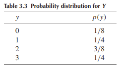

```{css,echo = F}
.small .remark-code { /*Change made here*/
  font-size: 85% !important;
}
.tiny .remark-code { /*Change made here*/
  font-size: 50% !important;
}
```

```{r,include=F}
set.seed(123)
options(width=60)
knitr::opts_chunk$set(fig.align='center',fig.width=9,fig.height=5)
def.chunk.hook  <- knitr::knit_hooks$get("chunk")
knitr::knit_hooks$set(chunk = function(x, options) {
  x <- def.chunk.hook(x, options)
  ifelse(options$size != "normalsize", paste0("\n \\", options$size,"\n\n", x, "\n\n \\normalsize"), x)
})
require(tidyverse)
```

# Agenda

1. Recap of Lecture 3

2. Random variables

3. Probability distributions

4. Expectations

5. Applied example in `R`

---

# Recap of Lecture 3

- We now have an intellectual foundation for probability

  - Probabilistic events in the context of an **experiment** and **simple events**
  
  - All possible events define the **sample space**
  
  - 3 axioms for how to assign probabilities to events (lecture 2)
  
  - 4 tools to decompose and compose events of interest (lecture 3)


---

# One additional tool

- Assigning probabilities in a sample space consisting of **equiprobable events**

- $S$ consists of $n$ **equiprobable** events $E$ such that $P(E_1) = P(E_2) = \dots = P(E_n)$

  - Recall we define $A$ as a subset of $S$: some subset of sample points that make up $S$
  
  - Then $P(A) = \frac{|A|}{n}$ where $|A|$ indicates the number of elements in $A$
  

---

# Random Variables

- Experiment where events of interest are **numerical**

  - Identified in a meaningful way by numbers
  
  - I.e., number of seats held by Republican Party in the House after a midterm election
  
  - We assign a *real number* to each point in the sample space
  
  - Call this number the variable $Y$
  
- What is a variable?

--

  - A logical grouping of attributes
  
  - Take on values that are **exhaustive** and **mutually exclusive**

--

- Thus each sample point can only take on one value of $Y$, but the same values of $Y$ may be assigned to multiple sample points

---

# Functions

- We **map** numeric values using a **function**

- Thus the numeric random variable $Y$ is a **function** of the sample points in $S$

- A function is a mathematical relation assigning each element of one set (the source) to one and only one element of another set (the target)

  - The function's **source** is $S$ and its **target** is $Y$
  
  - $f: S \rightarrow Y$
  
  - This function (and by extension, $Y$) is a **random variable**
  
- Whenever we talk about a random variable, *we are really talking about a function* that maps each simple event in a sample space $S$ to a meaningful number

---

# Notation

- Random variables expressed with capital letters: i.e., $Y$

- Interested in the probability a random variable takes on some value

  - Probability that $Y = 0$ written as $P(Y = 0)$
  
- Denote observed or hypothetical values of $Y$ with lowercase letters

  - $P(Y = y)$
  
- Still fundamentally interested in **events of interest** $A$, but denote with numbers $a$

  - $A \equiv \{\text{all sample points such that }Y = a\}$
  
---

# Quick Detour: Random Samples

- Our experiment is the drawing of a **sample** from a population

  - **Sample**: the units selected for analysis
  
  - **Population**: the group of units about which we want to make inferences
  
- The **design** of our experiment is the method of sampling

  - Do we sample *with replacement*? Units are put back into the population after being sampled, and we might re-sample them again

---

# Quick Detour: Random Samples
  
- Most common design is **random sampling**

  - Let $N$ be the number of elements in the population and $n$ be the number of elements in our sample
  
  - How many different samples without replacement can we draw?
  
--

  - $\bigg(\frac{N}{n}\bigg) = \frac{N!}{n!(N - n)!}$
  
  - If we draw these $n$ elements with equal probability, this is a **random sample**
  
---

# Back to RVs: Probability Distributions

- Start with **discrete** random variables

  - $Y$ is discrete if it can only take on finite or countably infinite number of distinct values
  
  - "Countably infinite": a one-to-one correspondence with the integers
  
- To make inferences about the **population** based on a **sample**:

  - Need to know the probability of observing a particular event
  
    - Events are numerical events corresponding to values $y$ of discrete random variables $Y$
    
  - $P(Y = y)$ for all the values $Y$ can take on
  
  - The collection of these probabilities is a **probability distribution**
  
---

# Example: dice

- Experiment: roll a pair of six-sided dice and record the sum of their faces

  - Sample space consists of 36 simple events
  
  - Random variable $Y$ is the sum of the faces
  
  - $P(Y = y) = \sum_{E_i: Y(E_i) = y}P(E_i)$
  
  - Sometimes written as $p(y)$
  
- Can express $Y$'s probability distribution as a **table**, a **graph**, or a **function**

---

# Probability Distribution: Table

```{r,echo=F,message=F,warning=F}
require(tidyverse)
p <- data.frame(y = 2:12,
           samples = c(1:6,5:1)) %>%
  mutate(Pr_y = paste0(samples,'/36'),
         Pr_y_dec = round(samples/sum(samples),4))
p
```

---

# Probability Distribution: Graph

```{r}
p %>%
  ggplot(aes(x = factor(y),y = Pr_y_dec)) + 
  geom_bar(stat = 'identity')
```

---

# Probability Distribution: Function

$$P(Y = y) = p(y) = \frac{6 - |7-y|}{36},\; y = \{1,2,3,\dots,12\}$$
```{r}
pdf_dice <- function(y) {
  (6 - abs(7 - y)) / 36
}
pdf_dice(y = 2:12)
```

- Also called a **probability mass function** or **PMF**

- PDF is a **theoretical model** for the empirical distribution of data associated with a real population

  - If we re-roll a pair of dice multiple times, empirical distribution would look *like* the theoretical probability distribution
  
---

# Expectations

- We can summarize a random variable with its central tendency and dispersion
  
- We can specify and manipulate formulas describing random variables using the **expectations operator**

  - **Expected value** of $Y$ is $E(Y) \equiv \sum_y yp(y)$
  
  - Each possible value of $Y$ multiplied by the probability of it appearing, summed up over all $y$
  
  - Apply this to the dice example!
  
- The **expected value** is how we talk about the central tendency of a random variable with a theoretical probability distribution

  - Equivalent to the concept of the *mean of an empirical frequency distribution*
  
---

# Expectations

- Recall that the probability distribution of a random variable is a *theoretical model* for the empirical distribution of data **associated with a real population**

  - If the theoretical model is **accurate**, then $E(Y) = \mu$
  
- $\mu$ is the **population mean** which is a "parameter"
  
  - **Parameter**: characteristic of the distribution $Y$ in the population that we never actually observe
  
---

# Expectations

- The expected value concept can be applied to any **function of a random variable**

  - Consider any real-valued function of $Y$, denoted $g(Y)$
  
  - $E[g(Y)] = \sum_y g(y)p(y)$
  
- Instead of summing over the discrete values of $y$ multiplied by their probability $p(y)$, we are summing over the discrete values of $y$ that are transformed with the function $g(y)$

- NB: $E[g(Y)] = \sum_y g(y)p(y)$ is not a definition. We have to **prove** it.

---

# A proof

- Denote a random variable $Y$ taking on $n$ values $y_1, y_2, \dots, y_n$

- Denote a function $g(y)$ that takes on $m$ different values $g_1, g_2, \dots, g_m,\; m\leq n$

- Note that $g(Y)$ is itself a random variable

  - This means we can denote a new probability function $p^*$ that describes the probability that $g$ takes on a value $g_i$
  
  - $p^*(g_i) = P[g(Y) = g_i]$
  
  - $p^*(g_i) = \sum_{y_j:g(y_j) = g_i} p(y_j)$
  
  - Definition: $y_j:g(y_j) = g_i$ means "all $y_j$ such that $g = g_i$ when evaluated at $y_j$"
  
---

# Proof contd

- Definition of expected value: $E[g(Y)] = \sum_{i = 1}^m g_ip^*(g_i)$

- Substitute: $E[g(Y)] = \sum_{i = 1}^m g_i \bigg(\sum_{y_j:g(y_j) = g_i} p(y_j)\bigg)$

- Rearrange: $E[g(Y)] = \sum_{i = 1}^m \bigg(\sum_{y_j:g(y_j) = g_i} g_i p(y_j)\bigg)$

- Substitute: $E[g(Y)] = \sum_{j = 1}^n g(y_j) p(y_j)$

- Simplify: $E[g(Y)] = \sum_y g(y)p(y) \blacksquare$

---

# Variance

- Using these tools, we can also define the variance of $Y$

- Remember that the variance of an empirical variable is $s^2 = \frac{1}{N}\sum_{i = 1}^N (y_i - \bar{y})^2$

- Same idea for a random variable!

- $\textit{VAR}(Y) \equiv E[(Y-E(Y))^2]$

- If $Y$ accurately describes the population distribution, then $\textit{VAR}(Y) = E[(Y - \mu)^2]$

- Denote $\textit{VAR}(Y) = \sigma^2$ and the standard deviation of $Y$ is $\sqrt{\sigma^2} = \sigma$

---

# Example

<center></center>

- What is the mean, variance, and standard deviation of $Y$?

--

- Mean: $E(Y) = \sum_{y = 0}^3 yp(y) = (0)(1/8) + (1)(1/4) + (2)(3/8) + (3)(1/4) = 1.75$

- Variance: $\sigma^2 = E[(Y - \mu)^2] = \sum_{y = 0}^3 (y - \mu)^2 p(y)$

  - $(0 - 1.75)^2(1/8) + (1 - 1.75)^2(1/8) + (2 - 1.75)^2(1/8) + (3 - 1.75)^2(1/8) = 0.9375$
  
- Standard deviation: $\sigma = \sqrt{\sigma^2} = \sqrt{0.9375} = 0.97$

---

# Helpful results

- $E(c) = c$

  - Let $g(Y) \equiv c$
  
  - $E(c) = \sum_y cp(y)$
  
  - $E(c) = c\sum_y p(y)$
  
  - Axiom 2: $\sum_y p(y) = 1$
  
  - Thus $E(c) = c\;\blacksquare$
  
---

# Helpful results

- $E[cg(Y)] = cE[g(Y)]$

  - $E[cg(Y)] = \sum_y cg(y)p(y)$
  
  - $E[cg(Y)] = c\sum_y g(y)p(y)$
  
  - $E[cg(Y)] = cE[g(Y)]\; \blacksquare$
  
---

# Helpful results

- We can **distribute expectations**: consider $k = 2$

  - $g_1(Y) + g_2(Y)$ is a function of $Y$: $E[g_1(Y) + g_2(Y)] = \sum_y[g_1(y) + g_2(y)]p(y)$
  
  - $E[g_1(Y) + g_2(Y)] = \sum_y[g_1(y)p(y)] + \sum_y[g_2(y)p(y)]$
  
  - $E[g_1(Y) + g_2(Y)] = E[g_1(Y)] + E[g_2(Y)]\; \blacksquare$
  

---

# Demonstration in `R`

- Let's take a detour from this abstract work!

--

- Create a new `RMarkdown` file, require `tidyverse`, and load the data

```{r,message = F,warning=F}
require(tidyverse)

df <- read_rds('https://github.com/jbisbee1/PSCI_8356/raw/main/Lectures/Data/sc_debt.Rds')
```

---

# Looking at the data

- Always *always* **always** look at your data!

```{r}
df
```

---

# Looking at the data

- What are the **units of observation**?

- What are the **variables**?

--

  - What is the definition of a variable?
  
---

# Looking at the data

- Can you find an example of a **nominal** variable? What about an **ordinal**, **interval**, and **ratio**?

--

```{r}
# Some nominal variables (what is the definition?)
df %>%
  select(instnm,stabbr,control,region)
```

---

# Looking at the data

- Can you find an example of a **nominal** variable? What about an **ordinal**, **interval**, and **ratio**?

```{r}
# Is this an ordinal variable?
df %>%
  select(preddeg)
```

---

# Looking at the data

- Can you find an example of a **nominal** variable? What about an **ordinal**, **interval**, and **ratio**?

```{r}
# Is this an interval or a ratio variable?
df %>%
  select(sat_avg)
```

---

# Summarizing data

- Recall the different approaches to **summarizing data**

---

# Summarizing data: Frequency tables

- Recall the different approaches to **summarizing data**

```{r}
df %>%
  count(stabbr) %>%
  arrange(desc(n))
```

---

# Summarizing data: Plots

- Recall the different approaches to **summarizing data**

```{r}
df %>%
  count(stabbr) %>%
  ggplot(aes(x = stabbr,y = n)) + 
  geom_bar(stat = 'identity')
```

---

# Summarizing data: Plots

- Recall the different approaches to **summarizing data**

```{r}
df %>%
  count(stabbr) %>%
  ggplot(aes(y = stabbr,x = n)) + 
  geom_bar(stat = 'identity')
```

---

# Summarizing data: Plots

- Recall the different approaches to **summarizing data**

```{r}
df %>%
  count(stabbr) %>%
  ggplot(aes(y = reorder(stabbr,n),x = n)) + 
  geom_bar(stat = 'identity')
```

---

# Summarizing Data: Plots

- What about for an interval variable?

```{r,message=F,warning=F}
df %>%
  ggplot(aes(x = sat_avg)) + 
  geom_histogram()
```

---

# Summarizing Data: Plots

- What about for an interval variable?

```{r,message=F,warning=F}
df %>%
  ggplot(aes(x = sat_avg)) + 
  geom_density()
```

---

# Summarizing Data: Plots

- Describe this qualitatively! Is this skewed? Bimodal?

```{r,message=F,warning=F}
df %>%
  ggplot(aes(x = sat_avg)) + 
  geom_density()
```

---

# Summarizing Data

- Recall our two summary statistics of interest

--

  - **Central Tendency**: The *typical value*
  
  - **Dispersion**: The *spread*
  
--

- What are the various measures for each?

---

# Summarizing Data: Central Tendency

```{r}
# Mode
df %>%
  count(region) %>%
  filter(n == max(n))
```

---

# Summarizing Data: Central Tendency

```{r}
df %>%
  summarise(avg_earnings = mean(md_earn_wne_p6,na.rm=T)) # Mean
df %>%
  summarise(median_sat = median(sat_avg,na.rm=T)) # Median
```

--

- Is this weird to take the median of the average SAT scores??

  - Recall what the **units** are in the data!
  
---

# Summarizing Data: Dispersion

```{r}
df %>%
  summarise(range_sat = range(sat_avg,na.rm=T)) # Range

df %>%
  summarise(iqr_sat = quantile(sat_avg,p = c(.25,.75),na.rm=T)) # IQR
```

---

# Summarizing Data: Dispersion

```{r}
df %>%
  summarise(var_sat = var(sat_avg,na.rm=T)) # Variance
```

---

# Summarizing Data: Manually

```{r}
df %>%
  select(sat_avg) %>%
  mutate(ybar = mean(sat_avg,na.rm=T)) %>% # Calculate Y bar
  mutate(yi_ybar = sat_avg - ybar) %>% # Calculate diffs
  mutate(yi_ybar2 = yi_ybar^2) %>% # Square diffs
  mutate(yi_yibar2_sum = sum(yi_ybar2,na.rm=T)) %>% # Sum squared diffs
  mutate(N = sum(!is.na(sat_avg))) %>% # Calculate N
  mutate(var_sat = yi_yibar2_sum / (N)) # Calculate variance
```

---

# Quiz

- Why is the result produced by the `R` function `var()` difference from my manual attempt?

--

- Look up the difference between a theoretical measure and an empirical one!


```{r,message=F,echo=F,warning=F,results='hide'}
dir <- getwd()
type <- 'pdf'
format <- 'landscape'
f <- 'Lecture_4_slides'

system(paste('Rscript ../NFGH/chromeprint.R',dir,type,format,f),wait = F)
```